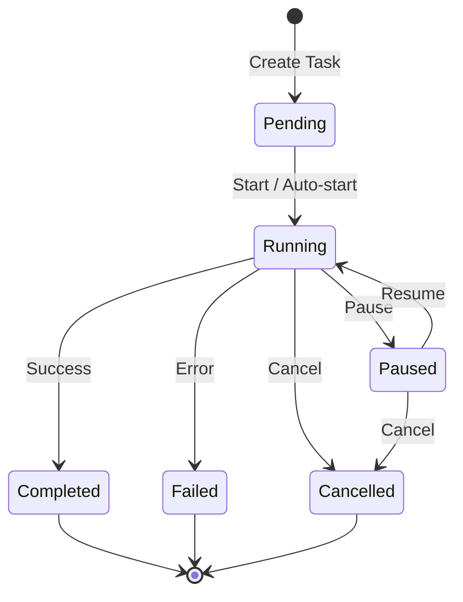

# Chat to Tasks System Transformation Plan

**Date**: 2025-12-06
**Status**: Planning
**Author**: Claude (Research & Planning Agent)
**Priority**: High

---

## Table of Contents

1. [Executive Summary](#1-executive-summary)
2. [Current State Analysis](#2-current-state-analysis)
3. [Terminology & Naming Strategy](#3-terminology--naming-strategy)
4. [Architecture Design](#4-architecture-design)
5. [Data Model Updates](#5-data-model-updates)
6. [Backend Implementation](#6-backend-implementation)
7. [Frontend Implementation](#7-frontend-implementation)
8. [Migration Strategy](#8-migration-strategy)
9. [Testing Strategy](#9-testing-strategy)
10. [Risk Assessment](#10-risk-assessment)
11. [Implementation Phases](#11-implementation-phases)
12. [File-by-File Changes](#12-file-by-file-changes)

---

## 1. Executive Summary

### Objective

Transform the existing single-conversation Chat interface into a multi-concurrent Tasks system that allows users to:

- Run multiple Claude Code tasks simultaneously per project
- Monitor task progress and status independently
- Switch between active tasks without blocking
- Manage task lifecycle (create, pause, resume, cancel, delete)

### Key Architectural Changes

| Area | Current State | Target State |
|------|---------------|--------------|
| Concurrency | 1 session active at a time | Multiple tasks running in parallel |
| Terminology | Chat, Session, Message | Task, Task Instance, Message |
| Process Management | Single `StreamProcesses` map | Task pool with resource limits |
| UI Pattern | Single conversation view | Task list + task detail split view |
| Status Tracking | Implicit (streaming vs not) | Explicit status enum (pending, running, paused, completed, failed) |

### Success Criteria

1. Support 5+ concurrent tasks per project (configurable)
2. Task isolation - one task failure does not affect others
3. Real-time status updates for all active tasks
4. Seamless UI switching between tasks
5. Full backward compatibility with existing session data

---

## 2. Current State Analysis

### 2.1 Backend Architecture

**Location**: `src-tauri/src/chat/`

```
src-tauri/src/chat/
├── mod.rs           # Module exports
├── session.rs       # ChatSession, ChatMessage, ChatConfig structs
├── storage.rs       # File-based session storage (~/.ccconfig/chat-sessions/)
├── claude_cli.rs    # Claude CLI spawn, streaming, process management
├── commands.rs      # 9 Tauri commands
└── tests.rs         # 27 unit tests
```

**Key Components**:

1. **StreamProcesses**: `Arc<Mutex<HashMap<String, tokio::process::Child>>>`
   - Global process registry keyed by session_id
   - Single lock for all operations
   - No resource limits

2. **spawn_claude_stream()**: Spawns Claude CLI with streaming JSON output
   - One process per session at a time
   - Stores child process in StreamProcesses
   - Emits events: `chat-stream:{session_id}`

3. **Session Storage**: JSON files in `~/.ccconfig/chat-sessions/{uuid}.json`
   - Contains session metadata + all messages
   - No status tracking
   - Project-scoped listing

### 2.2 Frontend Architecture

**Location**: `src/components/chat/` and `src/lib/chat-query.ts`

```
src/components/chat/
├── index.ts              # Exports
├── ChatSidebar.tsx       # Main container (single session view)
├── ChatMessages.tsx      # Message list with streaming
├── ChatInput.tsx         # Text input component
├── UserMessage.tsx       # User message display
├── AssistantMessage.tsx  # Assistant message with markdown
├── ModelSelector.tsx     # Model dropdown
├── MarkdownRenderer.tsx  # Markdown with syntax highlighting
└── ToolUseIndicator.tsx  # Tool usage display
```

**React Query Hooks** (`src/lib/chat-query.ts`):
- `useCheckClaudeInstalled()` - Check CLI availability
- `useCreateChatSession()` - Create new session
- `useChatSessions(projectPath)` - List sessions
- `useChatMessages(sessionId)` - Get messages
- `useDeleteChatSession()` - Delete session
- `useSendChatMessage()` - Send message (triggers streaming)
- `useCancelChatStream()` - Cancel streaming
- `useSaveAssistantMessage()` - Save final assistant message
- `useUpdateSessionTitle()` - Rename session
- `useChatStreamListener()` - Listen to streaming events

### 2.3 Routing

**Current Route**: `/context/project/:projectPath/chat`

**Component**: `ChatSidebar` rendered in sidebar position

### 2.4 Limitations Identified

1. **Single Active Session**: UI assumes one active session at a time
2. **No Status Tracking**: Session status is implicit (streaming or not)
3. **No Task Queue**: No prioritization or resource management
4. **Blocking UI**: Sending a message blocks until streaming completes
5. **No Pause/Resume**: Cannot pause and resume tasks
6. **Limited Visibility**: Cannot see status of multiple sessions simultaneously

---

## 3. Terminology & Naming Strategy

### 3.1 Core Terminology Mapping

| Old Term | New Term | Description |
|----------|----------|-------------|
| Chat | Tasks | Top-level feature name |
| Chat Session | Task | A unit of work/conversation |
| Message | Message | Unchanged - messages within a task |
| Session ID | Task ID | Unique identifier |
| Chat Config | Task Config | Configuration per task |

### 3.2 Status Terminology

```typescript
enum TaskStatus {
  Pending = "pending",      // Created, not started
  Running = "running",      // Claude CLI actively processing
  Paused = "paused",        // User paused, can resume
  Completed = "completed",  // Task finished successfully
  Failed = "failed",        // Task encountered error
  Cancelled = "cancelled"   // User cancelled
}
```

### 3.3 UI Terminology

| UI Element | Label |
|------------|-------|
| Navigation item | "Tasks" |
| Create button | "New Task" |
| Task list header | "Active Tasks" / "All Tasks" |
| Empty state | "No tasks yet. Create one to get started." |
| Status badge | Running / Paused / Completed / Failed |
| Action buttons | Start / Pause / Resume / Cancel / Delete |

### 3.4 File/Module Naming

| Old Name | New Name |
|----------|----------|
| `chat/` | `tasks/` |
| `session.rs` | `task.rs` |
| `ChatSession` | `Task` |
| `ChatMessage` | `TaskMessage` |
| `chat-query.ts` | `task-query.ts` |
| `ChatSidebar` | `TasksPage` |
| `ChatMessages` | `TaskMessages` |

---

## 4. Architecture Design

### 4.1 High-Level Architecture

```
+-------------------+     +-------------------+     +------------------+
|   Tasks UI        |     |   Task Manager    |     |   Claude CLI     |
|   (React)         |     |   (Rust/Tauri)    |     |   Processes      |
+-------------------+     +-------------------+     +------------------+
        |                         |                        |
        |  Create Task            |                        |
        |------------------------>|                        |
        |                         |  Validate & Queue      |
        |                         |----------------------->|
        |                         |                        |
        |  Task Created           |                        |
        |<------------------------|                        |
        |                         |                        |
        |  Start Task             |                        |
        |------------------------>|                        |
        |                         |  Spawn Process         |
        |                         |----------------------->|
        |                         |                        |
        |  Status: Running        |  Streaming Output      |
        |<------------------------|<-----------------------|
        |                         |                        |
        |  Events (per task)      |                        |
        |<------------------------|                        |
```

### 4.2 Concurrent Task Management

```
TaskManager
├── TaskPool
│   ├── max_concurrent: usize (default: 5)
│   ├── active_tasks: HashMap<TaskId, TaskHandle>
│   └── pending_queue: VecDeque<TaskId>
├── TaskRegistry
│   ├── tasks: HashMap<TaskId, Task>
│   └── by_project: HashMap<ProjectPath, Vec<TaskId>>
└── EventDispatcher
    └── channels: HashMap<TaskId, broadcast::Sender>
```

### 4.3 Task State Machine



### 4.4 Event System

**Event Types**:
```rust
enum TaskEvent {
    StatusChanged { task_id: String, status: TaskStatus },
    MessageStart { task_id: String, message_id: String },
    ContentDelta { task_id: String, message_id: String, delta: String },
    MessageComplete { task_id: String, message_id: String, content: String },
    ToolUse { task_id: String, message_id: String, tool_name: String, input: Value },
    ToolResult { task_id: String, message_id: String, tool_name: String, output: String },
    Error { task_id: String, error: String },
    Progress { task_id: String, progress: TaskProgress },
}
```

**Event Channels**:
- Global: `tasks:global` - All task status changes
- Per-task: `tasks:{task_id}` - Specific task streaming

### 4.5 Resource Management

```rust
struct TaskPoolConfig {
    max_concurrent_tasks: usize,       // Default: 5
    max_tasks_per_project: usize,      // Default: 10
    task_timeout_ms: u64,              // Default: 30 minutes
    cleanup_completed_after_ms: u64,   // Default: 24 hours
}
```

---

## 5. Data Model Updates

### 5.1 Rust Data Structures

**New `task.rs`**:

```rust
use serde::{Deserialize, Serialize};
use std::time::SystemTime;

/// Task status enum
#[derive(Debug, Clone, Serialize, Deserialize, PartialEq)]
#[serde(rename_all = "lowercase")]
pub enum TaskStatus {
    Pending,
    Running,
    Paused,
    Completed,
    Failed,
    Cancelled,
}

/// Task priority
#[derive(Debug, Clone, Serialize, Deserialize, PartialEq)]
#[serde(rename_all = "lowercase")]
pub enum TaskPriority {
    Low,
    Normal,
    High,
}

impl Default for TaskPriority {
    fn default() -> Self {
        TaskPriority::Normal
    }
}

/// Task metadata
#[derive(Debug, Clone, Serialize, Deserialize)]
#[serde(rename_all = "camelCase")]
pub struct Task {
    pub id: String,
    pub project_path: String,
    pub title: String,
    pub description: Option<String>,
    pub status: TaskStatus,
    pub priority: TaskPriority,
    pub created_at: u64,
    pub updated_at: u64,
    pub started_at: Option<u64>,
    pub completed_at: Option<u64>,
    pub message_count: usize,
    pub error_message: Option<String>,
    pub tags: Vec<String>,
}

/// Task message (unchanged structure, renamed)
#[derive(Debug, Clone, Serialize, Deserialize)]
#[serde(rename_all = "camelCase")]
pub struct TaskMessage {
    pub id: String,
    pub task_id: String,
    pub role: MessageRole,
    pub content: String,
    pub timestamp: u64,
    #[serde(skip_serializing_if = "Option::is_none")]
    pub tool_use: Option<ToolUse>,
    #[serde(skip_serializing_if = "Option::is_none")]
    pub metadata: Option<serde_json::Value>,
}

#[derive(Debug, Clone, Serialize, Deserialize, PartialEq)]
#[serde(rename_all = "lowercase")]
pub enum MessageRole {
    User,
    Assistant,
    System,
    Tool,
}

#[derive(Debug, Clone, Serialize, Deserialize)]
#[serde(rename_all = "camelCase")]
pub struct ToolUse {
    pub tool_name: String,
    pub input: serde_json::Value,
    #[serde(skip_serializing_if = "Option::is_none")]
    pub output: Option<String>,
}

/// Task configuration
#[derive(Debug, Clone, Serialize, Deserialize)]
#[serde(rename_all = "camelCase")]
pub struct TaskConfig {
    pub model: String,
    pub permission_mode: PermissionMode,
    #[serde(skip_serializing_if = "Option::is_none")]
    pub max_tokens: Option<u32>,
    #[serde(skip_serializing_if = "Option::is_none")]
    pub temperature: Option<f32>,
    #[serde(skip_serializing_if = "Option::is_none")]
    pub system_prompt: Option<String>,
    pub auto_start: bool,
}

#[derive(Debug, Clone, Serialize, Deserialize, PartialEq)]
#[serde(rename_all = "lowercase")]
pub enum PermissionMode {
    Default,
    AcceptEdits,
    BypassPermissions,
    Plan,
}

impl Default for TaskConfig {
    fn default() -> Self {
        Self {
            model: "sonnet".to_string(),
            permission_mode: PermissionMode::Default,
            max_tokens: None,
            temperature: None,
            system_prompt: None,
            auto_start: true,
        }
    }
}

/// Task progress information
#[derive(Debug, Clone, Serialize, Deserialize)]
#[serde(rename_all = "camelCase")]
pub struct TaskProgress {
    pub current_step: String,
    pub tokens_used: Option<u32>,
    pub elapsed_ms: u64,
}

impl Task {
    pub fn new(project_path: String, title: String) -> Self {
        let now = SystemTime::now()
            .duration_since(SystemTime::UNIX_EPOCH)
            .unwrap()
            .as_secs();

        Self {
            id: uuid::Uuid::new_v4().to_string(),
            project_path,
            title,
            description: None,
            status: TaskStatus::Pending,
            priority: TaskPriority::Normal,
            created_at: now,
            updated_at: now,
            started_at: None,
            completed_at: None,
            message_count: 0,
            error_message: None,
            tags: Vec::new(),
        }
    }

    pub fn with_description(mut self, description: String) -> Self {
        self.description = Some(description);
        self
    }

    pub fn with_priority(mut self, priority: TaskPriority) -> Self {
        self.priority = priority;
        self
    }

    pub fn with_tags(mut self, tags: Vec<String>) -> Self {
        self.tags = tags;
        self
    }
}
```

### 5.2 TypeScript Interfaces

**New `src/lib/task-types.ts`**:

```typescript
export type TaskStatus =
  | "pending"
  | "running"
  | "paused"
  | "completed"
  | "failed"
  | "cancelled";

export type TaskPriority = "low" | "normal" | "high";

export interface Task {
  id: string;
  projectPath: string;
  title: string;
  description?: string;
  status: TaskStatus;
  priority: TaskPriority;
  createdAt: number;
  updatedAt: number;
  startedAt?: number;
  completedAt?: number;
  messageCount: number;
  errorMessage?: string;
  tags: string[];
}

export interface TaskMessage {
  id: string;
  taskId: string;
  role: "user" | "assistant" | "system" | "tool";
  content: string;
  timestamp: number;
  toolUse?: {
    toolName: string;
    input: unknown;
    output?: string;
  };
  metadata?: unknown;
}

export interface TaskConfig {
  model: string;
  permissionMode: "default" | "acceptEdits" | "bypassPermissions" | "plan";
  maxTokens?: number;
  temperature?: number;
  systemPrompt?: string;
  autoStart: boolean;
}

export interface TaskProgress {
  currentStep: string;
  tokensUsed?: number;
  elapsedMs: number;
}

export type TaskEvent =
  | { type: "statusChanged"; taskId: string; status: TaskStatus }
  | { type: "messageStart"; taskId: string; messageId: string }
  | { type: "contentDelta"; taskId: string; messageId: string; delta: string }
  | { type: "messageComplete"; taskId: string; messageId: string; content: string }
  | { type: "toolUse"; taskId: string; messageId: string; toolName: string; input: unknown }
  | { type: "toolResult"; taskId: string; messageId: string; toolName: string; output: string }
  | { type: "error"; taskId: string; error: string }
  | { type: "progress"; taskId: string; progress: TaskProgress };

// Filtering and sorting
export interface TaskFilter {
  status?: TaskStatus[];
  priority?: TaskPriority[];
  tags?: string[];
  search?: string;
}

export type TaskSortField = "createdAt" | "updatedAt" | "title" | "status" | "priority";
export type TaskSortOrder = "asc" | "desc";
```

### 5.3 Storage Schema Changes

**New storage directory**: `~/.ccconfig/tasks/`

**File structure**:
```
~/.ccconfig/tasks/
├── {task_uuid}.json        # Task data + messages
├── index.json              # Task index for quick listing
└── config.json             # Task manager configuration
```

**Task file format**:
```json
{
  "task": {
    "id": "uuid",
    "projectPath": "/path/to/project",
    "title": "Task title",
    "description": "Optional description",
    "status": "completed",
    "priority": "normal",
    "createdAt": 1733500000,
    "updatedAt": 1733500500,
    "startedAt": 1733500100,
    "completedAt": 1733500500,
    "messageCount": 4,
    "errorMessage": null,
    "tags": ["feature", "backend"]
  },
  "messages": [
    {
      "id": "msg-uuid",
      "taskId": "task-uuid",
      "role": "user",
      "content": "Create a new API endpoint",
      "timestamp": 1733500100
    }
  ]
}
```

---

## 6. Backend Implementation

### 6.1 New Module Structure

```
src-tauri/src/tasks/
├── mod.rs              # Module exports
├── task.rs             # Task, TaskMessage, TaskConfig structs
├── task_manager.rs     # TaskManager with concurrent execution
├── task_pool.rs        # TaskPool for resource management
├── storage.rs          # File-based storage with index
├── claude_runner.rs    # Claude CLI spawn and streaming
├── events.rs           # Event types and dispatcher
├── commands.rs         # Tauri commands
└── tests.rs            # Unit tests
```

### 6.2 Task Manager Implementation

**`task_manager.rs`**:

```rust
use std::collections::HashMap;
use std::sync::Arc;
use tokio::sync::{Mutex, RwLock, broadcast};
use tauri::AppHandle;

pub struct TaskManager {
    tasks: RwLock<HashMap<String, Task>>,
    active_processes: Mutex<HashMap<String, tokio::process::Child>>,
    config: TaskPoolConfig,
    event_sender: broadcast::Sender<TaskEvent>,
}

impl TaskManager {
    pub fn new(config: TaskPoolConfig) -> Self {
        let (tx, _) = broadcast::channel(1000);
        Self {
            tasks: RwLock::new(HashMap::new()),
            active_processes: Mutex::new(HashMap::new()),
            config,
            event_sender: tx,
        }
    }

    /// Create a new task
    pub async fn create_task(
        &self,
        project_path: String,
        title: String,
        config: TaskConfig,
    ) -> Result<Task, String> {
        // Check project task limit
        let tasks = self.tasks.read().await;
        let project_tasks = tasks.values()
            .filter(|t| t.project_path == project_path)
            .count();

        if project_tasks >= self.config.max_tasks_per_project {
            return Err(format!(
                "Maximum tasks per project ({}) reached",
                self.config.max_tasks_per_project
            ));
        }
        drop(tasks);

        let task = Task::new(project_path, title);

        // Store task
        storage::save_task(&task, &[])?;

        let mut tasks = self.tasks.write().await;
        tasks.insert(task.id.clone(), task.clone());

        // Auto-start if configured
        if config.auto_start {
            // Queue for starting
            self.start_task_internal(&task.id).await?;
        }

        Ok(task)
    }

    /// Start a task
    pub async fn start_task(&self, task_id: &str) -> Result<(), String> {
        // Check concurrent task limit
        let processes = self.active_processes.lock().await;
        if processes.len() >= self.config.max_concurrent_tasks {
            return Err(format!(
                "Maximum concurrent tasks ({}) reached. Please wait for a task to complete.",
                self.config.max_concurrent_tasks
            ));
        }
        drop(processes);

        self.start_task_internal(task_id).await
    }

    async fn start_task_internal(&self, task_id: &str) -> Result<(), String> {
        let mut tasks = self.tasks.write().await;
        let task = tasks.get_mut(task_id)
            .ok_or_else(|| format!("Task not found: {}", task_id))?;

        if task.status != TaskStatus::Pending && task.status != TaskStatus::Paused {
            return Err(format!("Cannot start task in {:?} status", task.status));
        }

        task.status = TaskStatus::Running;
        task.started_at = Some(now_timestamp());
        task.updated_at = now_timestamp();

        // Emit status change
        self.emit_event(TaskEvent::StatusChanged {
            task_id: task_id.to_string(),
            status: TaskStatus::Running,
        });

        Ok(())
    }

    /// Pause a running task
    pub async fn pause_task(&self, task_id: &str) -> Result<(), String> {
        let mut tasks = self.tasks.write().await;
        let task = tasks.get_mut(task_id)
            .ok_or_else(|| format!("Task not found: {}", task_id))?;

        if task.status != TaskStatus::Running {
            return Err("Can only pause running tasks".to_string());
        }

        // Kill the process
        let mut processes = self.active_processes.lock().await;
        if let Some(mut child) = processes.remove(task_id) {
            let _ = child.kill().await;
        }

        task.status = TaskStatus::Paused;
        task.updated_at = now_timestamp();

        self.emit_event(TaskEvent::StatusChanged {
            task_id: task_id.to_string(),
            status: TaskStatus::Paused,
        });

        Ok(())
    }

    /// Resume a paused task
    pub async fn resume_task(
        &self,
        task_id: &str,
        app: AppHandle,
    ) -> Result<(), String> {
        self.start_task(task_id).await?;
        // Re-spawn the process with continuation
        // This requires storing conversation state
        Ok(())
    }

    /// Cancel a task
    pub async fn cancel_task(&self, task_id: &str) -> Result<(), String> {
        let mut tasks = self.tasks.write().await;
        let task = tasks.get_mut(task_id)
            .ok_or_else(|| format!("Task not found: {}", task_id))?;

        // Kill process if running
        let mut processes = self.active_processes.lock().await;
        if let Some(mut child) = processes.remove(task_id) {
            let _ = child.kill().await;
        }

        task.status = TaskStatus::Cancelled;
        task.completed_at = Some(now_timestamp());
        task.updated_at = now_timestamp();

        self.emit_event(TaskEvent::StatusChanged {
            task_id: task_id.to_string(),
            status: TaskStatus::Cancelled,
        });

        Ok(())
    }

    /// Get active task count
    pub async fn active_count(&self) -> usize {
        self.active_processes.lock().await.len()
    }

    /// Get all tasks for a project
    pub async fn get_project_tasks(&self, project_path: &str) -> Vec<Task> {
        let tasks = self.tasks.read().await;
        tasks.values()
            .filter(|t| t.project_path == project_path)
            .cloned()
            .collect()
    }

    /// Subscribe to task events
    pub fn subscribe(&self) -> broadcast::Receiver<TaskEvent> {
        self.event_sender.subscribe()
    }

    fn emit_event(&self, event: TaskEvent) {
        let _ = self.event_sender.send(event);
    }
}

fn now_timestamp() -> u64 {
    std::time::SystemTime::now()
        .duration_since(std::time::UNIX_EPOCH)
        .unwrap()
        .as_secs()
}
```

### 6.3 New Tauri Commands

**`commands.rs`**:

```rust
use super::task::{Task, TaskMessage, TaskConfig, TaskStatus, TaskPriority, TaskFilter};
use super::task_manager::TaskManager;
use super::storage;
use tauri::{AppHandle, State};

/// Check if Claude CLI is installed
#[tauri::command]
pub async fn task_check_claude_installed() -> Result<bool, String> {
    claude_runner::check_claude_installed().await
}

/// Create a new task
#[tauri::command]
pub async fn task_create(
    project_path: String,
    title: String,
    description: Option<String>,
    config: Option<TaskConfig>,
    manager: State<'_, TaskManager>,
) -> Result<Task, String> {
    let mut task = manager.create_task(
        project_path,
        title,
        config.unwrap_or_default(),
    ).await?;

    if let Some(desc) = description {
        task.description = Some(desc);
        storage::update_task(&task)?;
    }

    Ok(task)
}

/// Get all tasks for a project
#[tauri::command]
pub async fn task_list(
    project_path: String,
    filter: Option<TaskFilter>,
) -> Result<Vec<Task>, String> {
    storage::list_tasks(&project_path, filter)
}

/// Get a single task by ID
#[tauri::command]
pub async fn task_get(task_id: String) -> Result<Task, String> {
    storage::get_task(&task_id)
}

/// Get messages for a task
#[tauri::command]
pub async fn task_get_messages(task_id: String) -> Result<Vec<TaskMessage>, String> {
    let (_, messages) = storage::load_task(&task_id)?;
    Ok(messages)
}

/// Start a task
#[tauri::command]
pub async fn task_start(
    task_id: String,
    manager: State<'_, TaskManager>,
) -> Result<(), String> {
    manager.start_task(&task_id).await
}

/// Pause a running task
#[tauri::command]
pub async fn task_pause(
    task_id: String,
    manager: State<'_, TaskManager>,
) -> Result<(), String> {
    manager.pause_task(&task_id).await
}

/// Resume a paused task
#[tauri::command]
pub async fn task_resume(
    app: AppHandle,
    task_id: String,
    manager: State<'_, TaskManager>,
) -> Result<(), String> {
    manager.resume_task(&task_id, app).await
}

/// Cancel a task
#[tauri::command]
pub async fn task_cancel(
    task_id: String,
    manager: State<'_, TaskManager>,
) -> Result<(), String> {
    manager.cancel_task(&task_id).await
}

/// Delete a task
#[tauri::command]
pub async fn task_delete(task_id: String) -> Result<(), String> {
    storage::delete_task(&task_id)
}

/// Send a message to a task
#[tauri::command]
pub async fn task_send_message(
    app: AppHandle,
    task_id: String,
    message: String,
    config: Option<TaskConfig>,
    manager: State<'_, TaskManager>,
) -> Result<(), String> {
    // Load task
    let (mut task, mut messages) = storage::load_task(&task_id)?;

    // Add user message
    let user_msg = TaskMessage::new(task_id.clone(), MessageRole::User, message.clone());
    messages.push(user_msg);

    // Update task
    task.message_count = messages.len();
    task.updated_at = now_timestamp();
    storage::save_task(&task, &messages)?;

    // Spawn Claude CLI
    let cfg = config.unwrap_or_default();
    claude_runner::spawn_task_stream(
        app,
        task_id,
        message,
        task.project_path,
        cfg.model,
        manager.inner().clone(),
    ).await
}

/// Cancel streaming for a task
#[tauri::command]
pub async fn task_cancel_stream(
    task_id: String,
    manager: State<'_, TaskManager>,
) -> Result<(), String> {
    manager.cancel_task(&task_id).await
}

/// Save assistant response
#[tauri::command]
pub async fn task_save_assistant_message(
    task_id: String,
    content: String,
) -> Result<(), String> {
    let (mut task, mut messages) = storage::load_task(&task_id)?;

    let assistant_msg = TaskMessage::new(task_id.clone(), MessageRole::Assistant, content);
    messages.push(assistant_msg);

    task.message_count = messages.len();
    task.updated_at = now_timestamp();
    storage::save_task(&task, &messages)?;

    Ok(())
}

/// Update task metadata
#[tauri::command]
pub async fn task_update(
    task_id: String,
    title: Option<String>,
    description: Option<String>,
    priority: Option<TaskPriority>,
    tags: Option<Vec<String>>,
) -> Result<Task, String> {
    let (mut task, messages) = storage::load_task(&task_id)?;

    if let Some(t) = title {
        task.title = t;
    }
    if let Some(d) = description {
        task.description = Some(d);
    }
    if let Some(p) = priority {
        task.priority = p;
    }
    if let Some(t) = tags {
        task.tags = t;
    }

    task.updated_at = now_timestamp();
    storage::save_task(&task, &messages)?;

    Ok(task)
}

/// Get task manager statistics
#[tauri::command]
pub async fn task_get_stats(
    project_path: String,
    manager: State<'_, TaskManager>,
) -> Result<TaskStats, String> {
    let tasks = storage::list_tasks(&project_path, None)?;

    Ok(TaskStats {
        total: tasks.len(),
        pending: tasks.iter().filter(|t| t.status == TaskStatus::Pending).count(),
        running: tasks.iter().filter(|t| t.status == TaskStatus::Running).count(),
        paused: tasks.iter().filter(|t| t.status == TaskStatus::Paused).count(),
        completed: tasks.iter().filter(|t| t.status == TaskStatus::Completed).count(),
        failed: tasks.iter().filter(|t| t.status == TaskStatus::Failed).count(),
        cancelled: tasks.iter().filter(|t| t.status == TaskStatus::Cancelled).count(),
        active_processes: manager.active_count().await,
    })
}

#[derive(Debug, serde::Serialize)]
#[serde(rename_all = "camelCase")]
pub struct TaskStats {
    pub total: usize,
    pub pending: usize,
    pub running: usize,
    pub paused: usize,
    pub completed: usize,
    pub failed: usize,
    pub cancelled: usize,
    pub active_processes: usize,
}

/// Bulk operations
#[tauri::command]
pub async fn task_cancel_all(
    project_path: String,
    manager: State<'_, TaskManager>,
) -> Result<usize, String> {
    let tasks = manager.get_project_tasks(&project_path).await;
    let mut cancelled = 0;

    for task in tasks {
        if task.status == TaskStatus::Running || task.status == TaskStatus::Paused {
            if manager.cancel_task(&task.id).await.is_ok() {
                cancelled += 1;
            }
        }
    }

    Ok(cancelled)
}

#[tauri::command]
pub async fn task_delete_completed(project_path: String) -> Result<usize, String> {
    storage::delete_completed_tasks(&project_path)
}

/// Initialize task manager
pub fn init_task_manager() -> TaskManager {
    TaskManager::new(TaskPoolConfig::default())
}
```

---

## 7. Frontend Implementation

### 7.1 New Component Structure

```
src/components/tasks/
├── index.ts                   # Exports
├── TasksPage.tsx              # Main container (split view)
├── TaskList.tsx               # Left panel - task list
├── TaskListItem.tsx           # Individual task card
├── TaskDetail.tsx             # Right panel - task detail
├── TaskMessages.tsx           # Message list for task
├── TaskInput.tsx              # Input area
├── TaskHeader.tsx             # Task detail header
├── TaskStatusBadge.tsx        # Status indicator
├── TaskFilters.tsx            # Filter/sort controls
├── TaskActions.tsx            # Action buttons (start, pause, cancel)
├── CreateTaskDialog.tsx       # New task dialog
├── TaskStats.tsx              # Statistics display
├── UserMessage.tsx            # (reuse from chat)
├── AssistantMessage.tsx       # (reuse from chat)
├── MarkdownRenderer.tsx       # (reuse from chat)
└── ToolUseIndicator.tsx       # (reuse from chat)
```

### 7.2 React Query Hooks

**`src/lib/task-query.ts`**:

```typescript
import { useMutation, useQuery, useQueryClient, useSuspenseQuery } from "@tanstack/react-query";
import { invoke } from "@tauri-apps/api/core";
import { listen } from "@tauri-apps/api/event";
import { toast } from "sonner";
import { useEffect, useRef, useCallback } from "react";
import type {
  Task,
  TaskMessage,
  TaskConfig,
  TaskFilter,
  TaskEvent,
  TaskStatus,
  TaskPriority,
  TaskStats,
} from "./task-types";

// Check if Claude CLI is installed
export const useCheckClaudeInstalled = () => {
  return useQuery({
    queryKey: ["claude-cli-installed"],
    queryFn: () => invoke<boolean>("task_check_claude_installed"),
    staleTime: 60000,
  });
};

// Create a new task
export const useCreateTask = () => {
  const queryClient = useQueryClient();
  return useMutation({
    mutationFn: ({
      projectPath,
      title,
      description,
      config,
    }: {
      projectPath: string;
      title: string;
      description?: string;
      config?: TaskConfig;
    }) =>
      invoke<Task>("task_create", {
        projectPath,
        title,
        description,
        config,
      }),
    onSuccess: (task) => {
      queryClient.invalidateQueries({
        queryKey: ["tasks", task.projectPath],
      });
      toast.success("Task created");
    },
    onError: (error) => {
      toast.error(`Failed to create task: ${error}`);
    },
  });
};

// Get all tasks for a project
export const useTasks = (projectPath: string, filter?: TaskFilter) => {
  return useSuspenseQuery({
    queryKey: ["tasks", projectPath, filter],
    queryFn: () =>
      invoke<Task[]>("task_list", {
        projectPath,
        filter,
      }),
  });
};

// Get a single task
export const useTask = (taskId: string) => {
  return useSuspenseQuery({
    queryKey: ["task", taskId],
    queryFn: () => invoke<Task>("task_get", { taskId }),
  });
};

// Get task messages
export const useTaskMessages = (taskId: string) => {
  return useSuspenseQuery({
    queryKey: ["task-messages", taskId],
    queryFn: () => invoke<TaskMessage[]>("task_get_messages", { taskId }),
  });
};

// Start a task
export const useStartTask = () => {
  const queryClient = useQueryClient();
  return useMutation({
    mutationFn: (taskId: string) => invoke<void>("task_start", { taskId }),
    onSuccess: (_, taskId) => {
      queryClient.invalidateQueries({ queryKey: ["task", taskId] });
      queryClient.invalidateQueries({ queryKey: ["tasks"] });
      toast.success("Task started");
    },
    onError: (error) => {
      toast.error(`Failed to start task: ${error}`);
    },
  });
};

// Pause a task
export const usePauseTask = () => {
  const queryClient = useQueryClient();
  return useMutation({
    mutationFn: (taskId: string) => invoke<void>("task_pause", { taskId }),
    onSuccess: (_, taskId) => {
      queryClient.invalidateQueries({ queryKey: ["task", taskId] });
      queryClient.invalidateQueries({ queryKey: ["tasks"] });
      toast.success("Task paused");
    },
    onError: (error) => {
      toast.error(`Failed to pause task: ${error}`);
    },
  });
};

// Resume a task
export const useResumeTask = () => {
  const queryClient = useQueryClient();
  return useMutation({
    mutationFn: (taskId: string) => invoke<void>("task_resume", { taskId }),
    onSuccess: (_, taskId) => {
      queryClient.invalidateQueries({ queryKey: ["task", taskId] });
      queryClient.invalidateQueries({ queryKey: ["tasks"] });
      toast.success("Task resumed");
    },
    onError: (error) => {
      toast.error(`Failed to resume task: ${error}`);
    },
  });
};

// Cancel a task
export const useCancelTask = () => {
  const queryClient = useQueryClient();
  return useMutation({
    mutationFn: (taskId: string) => invoke<void>("task_cancel", { taskId }),
    onSuccess: (_, taskId) => {
      queryClient.invalidateQueries({ queryKey: ["task", taskId] });
      queryClient.invalidateQueries({ queryKey: ["tasks"] });
      toast.success("Task cancelled");
    },
    onError: (error) => {
      toast.error(`Failed to cancel task: ${error}`);
    },
  });
};

// Delete a task
export const useDeleteTask = () => {
  const queryClient = useQueryClient();
  return useMutation({
    mutationFn: (taskId: string) => invoke<void>("task_delete", { taskId }),
    onSuccess: () => {
      queryClient.invalidateQueries({ queryKey: ["tasks"] });
      toast.success("Task deleted");
    },
    onError: (error) => {
      toast.error(`Failed to delete task: ${error}`);
    },
  });
};

// Send a message to a task
export const useSendTaskMessage = () => {
  const queryClient = useQueryClient();
  return useMutation({
    mutationFn: ({
      taskId,
      message,
      config,
    }: {
      taskId: string;
      message: string;
      config?: TaskConfig;
    }) =>
      invoke<void>("task_send_message", {
        taskId,
        message,
        config,
      }),
    onSuccess: (_, { taskId }) => {
      queryClient.invalidateQueries({ queryKey: ["task-messages", taskId] });
      queryClient.invalidateQueries({ queryKey: ["tasks"] });
    },
    onError: (error) => {
      toast.error(`Failed to send message: ${error}`);
    },
  });
};

// Save assistant message
export const useSaveAssistantMessage = () => {
  const queryClient = useQueryClient();
  return useMutation({
    mutationFn: ({ taskId, content }: { taskId: string; content: string }) =>
      invoke<void>("task_save_assistant_message", { taskId, content }),
    onSuccess: (_, { taskId }) => {
      queryClient.invalidateQueries({ queryKey: ["task-messages", taskId] });
      queryClient.invalidateQueries({ queryKey: ["tasks"] });
    },
  });
};

// Update task
export const useUpdateTask = () => {
  const queryClient = useQueryClient();
  return useMutation({
    mutationFn: ({
      taskId,
      title,
      description,
      priority,
      tags,
    }: {
      taskId: string;
      title?: string;
      description?: string;
      priority?: TaskPriority;
      tags?: string[];
    }) =>
      invoke<Task>("task_update", {
        taskId,
        title,
        description,
        priority,
        tags,
      }),
    onSuccess: (task) => {
      queryClient.invalidateQueries({ queryKey: ["task", task.id] });
      queryClient.invalidateQueries({ queryKey: ["tasks"] });
    },
    onError: (error) => {
      toast.error(`Failed to update task: ${error}`);
    },
  });
};

// Get task statistics
export const useTaskStats = (projectPath: string) => {
  return useQuery({
    queryKey: ["task-stats", projectPath],
    queryFn: () => invoke<TaskStats>("task_get_stats", { projectPath }),
    refetchInterval: 5000, // Refresh every 5 seconds
  });
};

// Bulk operations
export const useCancelAllTasks = () => {
  const queryClient = useQueryClient();
  return useMutation({
    mutationFn: (projectPath: string) =>
      invoke<number>("task_cancel_all", { projectPath }),
    onSuccess: (count, projectPath) => {
      queryClient.invalidateQueries({ queryKey: ["tasks", projectPath] });
      toast.success(`Cancelled ${count} tasks`);
    },
  });
};

export const useDeleteCompletedTasks = () => {
  const queryClient = useQueryClient();
  return useMutation({
    mutationFn: (projectPath: string) =>
      invoke<number>("task_delete_completed", { projectPath }),
    onSuccess: (count, projectPath) => {
      queryClient.invalidateQueries({ queryKey: ["tasks", projectPath] });
      toast.success(`Deleted ${count} completed tasks`);
    },
  });
};

// Task stream listener
export const useTaskStreamListener = (
  taskId: string | null,
  onEvent: (event: TaskEvent) => void
) => {
  const unlistenRef = useRef<(() => void) | null>(null);
  const callbackRef = useRef(onEvent);
  callbackRef.current = onEvent;

  useEffect(() => {
    if (!taskId) return;

    const eventName = `tasks:${taskId}`;

    const setupListener = async () => {
      if (unlistenRef.current) {
        unlistenRef.current();
      }

      const unlisten = await listen<TaskEvent>(eventName, (event) => {
        callbackRef.current(event.payload);
      });

      unlistenRef.current = unlisten;
    };

    setupListener();

    return () => {
      if (unlistenRef.current) {
        unlistenRef.current();
        unlistenRef.current = null;
      }
    };
  }, [taskId]);
};

// Global task events listener (status changes)
export const useGlobalTaskListener = (
  projectPath: string,
  onEvent: (event: TaskEvent) => void
) => {
  const unlistenRef = useRef<(() => void) | null>(null);
  const callbackRef = useRef(onEvent);
  callbackRef.current = onEvent;

  useEffect(() => {
    const eventName = "tasks:global";

    const setupListener = async () => {
      if (unlistenRef.current) {
        unlistenRef.current();
      }

      const unlisten = await listen<TaskEvent>(eventName, (event) => {
        callbackRef.current(event.payload);
      });

      unlistenRef.current = unlisten;
    };

    setupListener();

    return () => {
      if (unlistenRef.current) {
        unlistenRef.current();
        unlistenRef.current = null;
      }
    };
  }, [projectPath]);
};
```

### 7.3 Main Tasks Page Component

**`src/components/tasks/TasksPage.tsx`**:

```typescript
import { useState, Suspense } from "react";
import { useParams } from "react-router-dom";
import { Alert, AlertDescription } from "@/components/ui/alert";
import { Button } from "@/components/ui/button";
import { PlusCircle } from "lucide-react";
import { TaskList } from "./TaskList";
import { TaskDetail } from "./TaskDetail";
import { CreateTaskDialog } from "./CreateTaskDialog";
import { TaskStats } from "./TaskStats";
import { useCheckClaudeInstalled, useTasks, useGlobalTaskListener } from "@/lib/task-query";
import type { TaskFilter, TaskEvent } from "@/lib/task-types";

export function TasksPage() {
  const { projectPath } = useParams<{ projectPath: string }>();
  const decodedProjectPath = projectPath ? decodeURIComponent(projectPath) : "";

  const { data: claudeInstalled } = useCheckClaudeInstalled();

  if (!claudeInstalled) {
    return (
      <div className="flex-1 p-4">
        <Alert>
          <AlertDescription>
            Claude CLI not installed. Please install Claude Code to use task features.
          </AlertDescription>
        </Alert>
      </div>
    );
  }

  return (
    <div className="flex-1 flex flex-col h-full">
      <Suspense
        fallback={
          <div className="flex-1 flex items-center justify-center">
            <p className="text-muted-foreground">Loading tasks...</p>
          </div>
        }
      >
        <TasksPageContent projectPath={decodedProjectPath} />
      </Suspense>
    </div>
  );
}

function TasksPageContent({ projectPath }: { projectPath: string }) {
  const [selectedTaskId, setSelectedTaskId] = useState<string | null>(null);
  const [filter, setFilter] = useState<TaskFilter>({});
  const [showCreateDialog, setShowCreateDialog] = useState(false);

  const { data: tasks, refetch } = useTasks(projectPath, filter);

  // Listen for global task events to refresh list
  useGlobalTaskListener(projectPath, (event: TaskEvent) => {
    if (event.type === "statusChanged") {
      refetch();
    }
  });

  // Auto-select first task if none selected
  if (!selectedTaskId && tasks.length > 0) {
    setSelectedTaskId(tasks[0].id);
  }

  return (
    <div className="flex h-full">
      {/* Left Panel - Task List */}
      <div className="w-80 border-r flex flex-col">
        {/* Header */}
        <div className="p-3 border-b flex items-center justify-between">
          <h2 className="font-semibold">Tasks</h2>
          <Button size="sm" onClick={() => setShowCreateDialog(true)}>
            <PlusCircle className="h-4 w-4 mr-1" />
            New Task
          </Button>
        </div>

        {/* Stats */}
        <TaskStats projectPath={projectPath} />

        {/* Task List */}
        <TaskList
          tasks={tasks}
          selectedTaskId={selectedTaskId}
          onSelectTask={setSelectedTaskId}
          filter={filter}
          onFilterChange={setFilter}
        />
      </div>

      {/* Right Panel - Task Detail */}
      <div className="flex-1 flex flex-col">
        {selectedTaskId ? (
          <Suspense
            fallback={
              <div className="flex-1 flex items-center justify-center">
                <p className="text-muted-foreground">Loading task...</p>
              </div>
            }
          >
            <TaskDetail
              taskId={selectedTaskId}
              onClose={() => setSelectedTaskId(null)}
            />
          </Suspense>
        ) : (
          <div className="flex-1 flex items-center justify-center text-muted-foreground">
            Select a task or create a new one
          </div>
        )}
      </div>

      {/* Create Task Dialog */}
      <CreateTaskDialog
        open={showCreateDialog}
        onOpenChange={setShowCreateDialog}
        projectPath={projectPath}
        onCreated={(task) => {
          setSelectedTaskId(task.id);
          setShowCreateDialog(false);
        }}
      />
    </div>
  );
}
```

### 7.4 Task List Component

**`src/components/tasks/TaskList.tsx`**:

```typescript
import { ScrollArea } from "@/components/ui/scroll-area";
import { TaskListItem } from "./TaskListItem";
import { TaskFilters } from "./TaskFilters";
import type { Task, TaskFilter } from "@/lib/task-types";

interface TaskListProps {
  tasks: Task[];
  selectedTaskId: string | null;
  onSelectTask: (taskId: string) => void;
  filter: TaskFilter;
  onFilterChange: (filter: TaskFilter) => void;
}

export function TaskList({
  tasks,
  selectedTaskId,
  onSelectTask,
  filter,
  onFilterChange,
}: TaskListProps) {
  return (
    <div className="flex-1 flex flex-col overflow-hidden">
      {/* Filters */}
      <TaskFilters filter={filter} onChange={onFilterChange} />

      {/* List */}
      <ScrollArea className="flex-1">
        {tasks.length === 0 ? (
          <div className="p-4 text-center text-muted-foreground text-sm">
            No tasks found
          </div>
        ) : (
          <div className="p-2 space-y-1">
            {tasks.map((task) => (
              <TaskListItem
                key={task.id}
                task={task}
                isSelected={task.id === selectedTaskId}
                onClick={() => onSelectTask(task.id)}
              />
            ))}
          </div>
        )}
      </ScrollArea>
    </div>
  );
}
```

### 7.5 Task Status Badge

**`src/components/tasks/TaskStatusBadge.tsx`**:

```typescript
import { Badge } from "@/components/ui/badge";
import {
  Clock,
  Play,
  Pause,
  CheckCircle,
  XCircle,
  AlertCircle,
  Loader2
} from "lucide-react";
import { cn } from "@/lib/utils";
import type { TaskStatus } from "@/lib/task-types";

interface TaskStatusBadgeProps {
  status: TaskStatus;
  size?: "sm" | "default";
}

const statusConfig: Record<
  TaskStatus,
  { label: string; icon: React.ElementType; variant: string; className: string }
> = {
  pending: {
    label: "Pending",
    icon: Clock,
    variant: "secondary",
    className: "bg-gray-100 text-gray-700",
  },
  running: {
    label: "Running",
    icon: Loader2,
    variant: "default",
    className: "bg-blue-100 text-blue-700",
  },
  paused: {
    label: "Paused",
    icon: Pause,
    variant: "secondary",
    className: "bg-yellow-100 text-yellow-700",
  },
  completed: {
    label: "Completed",
    icon: CheckCircle,
    variant: "secondary",
    className: "bg-green-100 text-green-700",
  },
  failed: {
    label: "Failed",
    icon: AlertCircle,
    variant: "destructive",
    className: "bg-red-100 text-red-700",
  },
  cancelled: {
    label: "Cancelled",
    icon: XCircle,
    variant: "secondary",
    className: "bg-gray-100 text-gray-500",
  },
};

export function TaskStatusBadge({ status, size = "default" }: TaskStatusBadgeProps) {
  const config = statusConfig[status];
  const Icon = config.icon;

  return (
    <Badge
      variant="secondary"
      className={cn(
        config.className,
        size === "sm" && "text-xs px-1.5 py-0"
      )}
    >
      <Icon
        className={cn(
          "mr-1",
          size === "sm" ? "h-3 w-3" : "h-3.5 w-3.5",
          status === "running" && "animate-spin"
        )}
      />
      {config.label}
    </Badge>
  );
}
```

---

## 8. Migration Strategy

### 8.1 Data Migration

**Phase 1: Schema Migration**

1. Create new `~/.ccconfig/tasks/` directory
2. Migrate existing sessions:
   ```
   Old: ~/.ccconfig/chat-sessions/{uuid}.json
   New: ~/.ccconfig/tasks/{uuid}.json
   ```
3. Transform data structure:
   - Add `status: "completed"` to migrated sessions
   - Add `priority: "normal"`
   - Add `tags: []`
   - Rename `sessionId` to `taskId` in messages
   - Keep original `createdAt`/`updatedAt`

**Migration Script** (Rust):

```rust
pub async fn migrate_chat_sessions() -> Result<usize, String> {
    let old_dir = dirs::home_dir()
        .ok_or("Could not find home directory")?
        .join(".ccconfig/chat-sessions");

    if !old_dir.exists() {
        return Ok(0); // Nothing to migrate
    }

    let new_dir = dirs::home_dir()
        .ok_or("Could not find home directory")?
        .join(".ccconfig/tasks");

    fs::create_dir_all(&new_dir)
        .map_err(|e| format!("Failed to create tasks directory: {}", e))?;

    let mut migrated = 0;

    for entry in fs::read_dir(&old_dir).map_err(|e| e.to_string())? {
        let entry = entry.map_err(|e| e.to_string())?;
        let path = entry.path();

        if path.extension().map_or(false, |ext| ext == "json") {
            let content = fs::read_to_string(&path)
                .map_err(|e| format!("Failed to read {}: {}", path.display(), e))?;

            let old_data: OldSessionStorage = serde_json::from_str(&content)
                .map_err(|e| format!("Failed to parse {}: {}", path.display(), e))?;

            let new_task = Task {
                id: old_data.session.id.clone(),
                project_path: old_data.session.project_path,
                title: old_data.session.title,
                description: None,
                status: TaskStatus::Completed,
                priority: TaskPriority::Normal,
                created_at: old_data.session.created_at,
                updated_at: old_data.session.updated_at,
                started_at: Some(old_data.session.created_at),
                completed_at: Some(old_data.session.updated_at),
                message_count: old_data.session.message_count,
                error_message: None,
                tags: Vec::new(),
            };

            let new_messages: Vec<TaskMessage> = old_data.messages
                .into_iter()
                .map(|m| TaskMessage {
                    id: m.id,
                    task_id: m.session_id,
                    role: m.role,
                    content: m.content,
                    timestamp: m.timestamp,
                    tool_use: m.tool_use,
                    metadata: m.metadata,
                })
                .collect();

            let new_path = new_dir.join(format!("{}.json", new_task.id));
            storage::save_task_to_path(&new_path, &new_task, &new_messages)?;

            migrated += 1;
        }
    }

    // Optionally backup and remove old directory
    let backup_dir = old_dir.with_extension("backup");
    fs::rename(&old_dir, &backup_dir).ok();

    Ok(migrated)
}
```

### 8.2 Code Migration

**Approach**: Incremental migration with feature flag

1. **Phase 1**: Keep both systems (chat + tasks)
2. **Phase 2**: Migrate UI to tasks, deprecate chat
3. **Phase 3**: Remove chat code, finalize tasks

**Feature Flag**:

```typescript
// src/lib/feature-flags.ts
export const FEATURES = {
  USE_TASKS_SYSTEM: true, // Set to true when ready
};
```

### 8.3 Backward Compatibility

1. **Storage**: Old session files remain readable (migration on first load)
2. **API**: Chat commands remain functional but internally map to task commands
3. **Routes**: `/chat` redirects to `/tasks`
4. **Events**: Old event names (`chat-stream:*`) aliased to new names

---

## 9. Testing Strategy

### 9.1 Unit Tests

**Backend Tests** (`src-tauri/src/tasks/tests.rs`):

```rust
#[cfg(test)]
mod tests {
    use super::*;

    // Task creation tests
    #[test]
    fn test_task_new() { ... }

    #[test]
    fn test_task_with_priority() { ... }

    #[test]
    fn test_task_status_transitions() { ... }

    // Storage tests
    #[test]
    fn test_save_and_load_task() { ... }

    #[test]
    fn test_list_tasks_by_project() { ... }

    #[test]
    fn test_filter_tasks_by_status() { ... }

    // Task manager tests
    #[tokio::test]
    async fn test_create_task() { ... }

    #[tokio::test]
    async fn test_start_task() { ... }

    #[tokio::test]
    async fn test_pause_task() { ... }

    #[tokio::test]
    async fn test_cancel_task() { ... }

    #[tokio::test]
    async fn test_concurrent_task_limit() { ... }

    #[tokio::test]
    async fn test_project_task_limit() { ... }

    // Migration tests
    #[test]
    fn test_migrate_chat_session() { ... }
}
```

### 9.2 Integration Tests

```typescript
// tests/tasks.spec.ts
describe("Tasks System", () => {
  describe("Task Lifecycle", () => {
    it("should create a new task", async () => {});
    it("should start a pending task", async () => {});
    it("should pause a running task", async () => {});
    it("should resume a paused task", async () => {});
    it("should cancel a task", async () => {});
    it("should delete a task", async () => {});
  });

  describe("Concurrent Execution", () => {
    it("should run multiple tasks in parallel", async () => {});
    it("should respect max concurrent task limit", async () => {});
    it("should queue tasks when limit reached", async () => {});
    it("should isolate task failures", async () => {});
  });

  describe("Streaming", () => {
    it("should stream messages for a task", async () => {});
    it("should handle multiple concurrent streams", async () => {});
    it("should properly clean up on cancellation", async () => {});
  });
});
```

### 9.3 Edge Cases

1. **Resource Exhaustion**: What if all task slots are full?
   - Test: Attempt to start task at limit
   - Expected: Return error with clear message

2. **Process Cleanup**: What if app crashes during task execution?
   - Test: Kill app process, restart
   - Expected: Tasks marked as failed, processes cleaned up

3. **Concurrent Modifications**: What if same task modified from multiple places?
   - Test: Simultaneous pause and cancel
   - Expected: First operation wins, second returns error

4. **Storage Corruption**: What if task file is corrupted?
   - Test: Invalid JSON in task file
   - Expected: Skip corrupted file, log error

---

## 10. Risk Assessment

### 10.1 Technical Risks

| Risk | Severity | Likelihood | Mitigation |
|------|----------|------------|------------|
| Race conditions in task manager | High | Medium | Use proper locking, atomic operations |
| Memory leaks from orphan processes | High | Medium | Implement process cleanup daemon |
| Data loss during migration | High | Low | Backup before migration, validation |
| Event system overload | Medium | Medium | Implement event throttling |
| UI freezing with many tasks | Medium | Medium | Virtual scrolling, pagination |

### 10.2 UX Risks

| Risk | Severity | Likelihood | Mitigation |
|------|----------|------------|------------|
| Confusion with new terminology | Medium | High | Clear onboarding, help text |
| Lost work from accidental cancellation | High | Medium | Confirmation dialogs |
| Difficulty finding specific tasks | Medium | Medium | Search and filter functionality |
| Status visibility issues | Medium | Medium | Clear status indicators |

### 10.3 Performance Considerations

1. **Task List Rendering**: Virtual scrolling for 100+ tasks
2. **Event Handling**: Batch updates, debounce UI refreshes
3. **Storage I/O**: Lazy loading, caching, index file
4. **Process Management**: Proper cleanup, timeout handling

---

## 11. Implementation Phases

### Phase 1: Backend Foundation (Week 1)

**Duration**: 5 days
**Effort**: 40 hours

**Tasks**:
- [ ] Create `src-tauri/src/tasks/` module structure
- [ ] Implement Task, TaskMessage, TaskConfig structs
- [ ] Implement TaskManager with basic operations
- [ ] Implement file-based storage with new schema
- [ ] Create 15+ new Tauri commands
- [ ] Write 30+ unit tests
- [ ] Implement data migration function

**Deliverables**:
- Working backend with all CRUD operations
- Task lifecycle management
- Concurrent execution support
- Migration utility

### Phase 2: Frontend Core (Week 2)

**Duration**: 5 days
**Effort**: 40 hours

**Tasks**:
- [ ] Create `src/lib/task-types.ts` and `task-query.ts`
- [ ] Build TasksPage with split view layout
- [ ] Implement TaskList component
- [ ] Implement TaskDetail component
- [ ] Create TaskStatusBadge component
- [ ] Build CreateTaskDialog
- [ ] Implement TaskFilters

**Deliverables**:
- Functional Tasks page UI
- Task creation and selection
- Status display and filtering

### Phase 3: Task Operations (Week 3)

**Duration**: 5 days
**Effort**: 40 hours

**Tasks**:
- [ ] Implement start/pause/resume/cancel actions
- [ ] Build TaskMessages with streaming support
- [ ] Create TaskInput component
- [ ] Implement TaskActions toolbar
- [ ] Add bulk operations UI
- [ ] Implement task statistics display

**Deliverables**:
- Full task lifecycle control
- Message streaming per task
- Bulk operations

### Phase 4: Polish & Migration (Week 4)

**Duration**: 5 days
**Effort**: 40 hours

**Tasks**:
- [ ] Implement automatic data migration
- [ ] Update routing (chat -> tasks)
- [ ] Update navigation labels
- [ ] Add keyboard shortcuts
- [ ] Implement search functionality
- [ ] Performance optimization
- [ ] Remove deprecated chat code

**Deliverables**:
- Seamless migration from chat to tasks
- Updated navigation and routes
- Production-ready feature

### Phase 5: Testing & Documentation (Week 5)

**Duration**: 3-5 days
**Effort**: 24-40 hours

**Tasks**:
- [ ] Integration testing
- [ ] E2E testing with Playwright
- [ ] Cross-platform testing
- [ ] User documentation
- [ ] Update CLAUDE.md
- [ ] Performance benchmarking

**Deliverables**:
- Test coverage > 80%
- User documentation
- Performance report

---

## 12. File-by-File Changes

### 12.1 New Files to Create

**Backend (Rust)**:

| File | Purpose | LOC Est. |
|------|---------|----------|
| `src-tauri/src/tasks/mod.rs` | Module exports | 20 |
| `src-tauri/src/tasks/task.rs` | Data structures | 200 |
| `src-tauri/src/tasks/task_manager.rs` | Task orchestration | 350 |
| `src-tauri/src/tasks/storage.rs` | File storage | 250 |
| `src-tauri/src/tasks/claude_runner.rs` | CLI spawn & stream | 200 |
| `src-tauri/src/tasks/events.rs` | Event types | 80 |
| `src-tauri/src/tasks/commands.rs` | Tauri commands | 400 |
| `src-tauri/src/tasks/migration.rs` | Data migration | 150 |
| `src-tauri/src/tasks/tests.rs` | Unit tests | 500 |

**Total Rust**: ~2,150 LOC

**Frontend (TypeScript/React)**:

| File | Purpose | LOC Est. |
|------|---------|----------|
| `src/lib/task-types.ts` | Type definitions | 100 |
| `src/lib/task-query.ts` | React Query hooks | 350 |
| `src/components/tasks/index.ts` | Exports | 15 |
| `src/components/tasks/TasksPage.tsx` | Main container | 150 |
| `src/components/tasks/TaskList.tsx` | Task list | 100 |
| `src/components/tasks/TaskListItem.tsx` | List item | 80 |
| `src/components/tasks/TaskDetail.tsx` | Detail view | 200 |
| `src/components/tasks/TaskMessages.tsx` | Messages | 150 |
| `src/components/tasks/TaskInput.tsx` | Input | 80 |
| `src/components/tasks/TaskHeader.tsx` | Header | 60 |
| `src/components/tasks/TaskStatusBadge.tsx` | Badge | 60 |
| `src/components/tasks/TaskFilters.tsx` | Filters | 100 |
| `src/components/tasks/TaskActions.tsx` | Actions | 100 |
| `src/components/tasks/CreateTaskDialog.tsx` | Create dialog | 120 |
| `src/components/tasks/TaskStats.tsx` | Statistics | 80 |

**Total Frontend**: ~1,745 LOC

### 12.2 Files to Modify

| File | Changes |
|------|---------|
| `src-tauri/src/lib.rs` | Add tasks module, register commands |
| `src/router.tsx` | Update routes from /chat to /tasks |
| `src/components/ContextLayout.tsx` | Update navigation labels |
| `src/i18n/locales/*.json` | Add task-related translations |

### 12.3 Files to Delete (Phase 4)

| File | Reason |
|------|--------|
| `src-tauri/src/chat/` (entire directory) | Replaced by tasks |
| `src/components/chat/` (entire directory) | Replaced by tasks |
| `src/lib/chat-query.ts` | Replaced by task-query.ts |

### 12.4 Dependencies

**No new dependencies required** - leveraging existing:
- `@tanstack/react-query`
- `react-markdown`
- `react-syntax-highlighter`
- `shadcn/ui` components
- `tauri-apps/api`

---

## 13. Acceptance Criteria

### Phase 1 Complete When:
- [ ] All 15+ Tauri commands implemented and tested
- [ ] 30+ unit tests passing
- [ ] TaskManager supports concurrent tasks
- [ ] Storage migration function works

### Phase 2 Complete When:
- [ ] TasksPage renders with split view
- [ ] Tasks can be created via dialog
- [ ] Task selection and filtering works
- [ ] Status badges display correctly

### Phase 3 Complete When:
- [ ] All task lifecycle operations work (start/pause/resume/cancel)
- [ ] Streaming messages work for individual tasks
- [ ] Multiple tasks can stream simultaneously
- [ ] Bulk operations function correctly

### Phase 4 Complete When:
- [ ] Migration runs automatically on first launch
- [ ] Old session data preserved
- [ ] Routes updated, old routes redirect
- [ ] Chat code removed from codebase

### Final Acceptance:
- [ ] 5+ concurrent tasks run without issues
- [ ] No memory leaks after extended use
- [ ] All edge cases handled gracefully
- [ ] Performance acceptable (< 100ms UI operations)

---

## 14. Open Questions

1. **Resume Behavior**: How should resume work?
   - Option A: Continue from last message
   - Option B: Require user to send new message
   - **Recommendation**: Option B (simpler, clearer UX)

2. **Task History Limit**: How many tasks to keep?
   - Option A: Unlimited (let user clean up)
   - Option B: Auto-delete after 30 days
   - **Recommendation**: Option A with bulk delete feature

3. **Progress Tracking**: What progress info to show?
   - Option A: Just status badge
   - Option B: Token count, elapsed time
   - **Recommendation**: Option B (more informative)

4. **Task Templates**: Should we support task templates?
   - **Recommendation**: Defer to future phase

---

**Document Version**: 1.0
**Created**: 2025-12-06
**Total Estimated Effort**: 200-240 hours (5-6 weeks)
