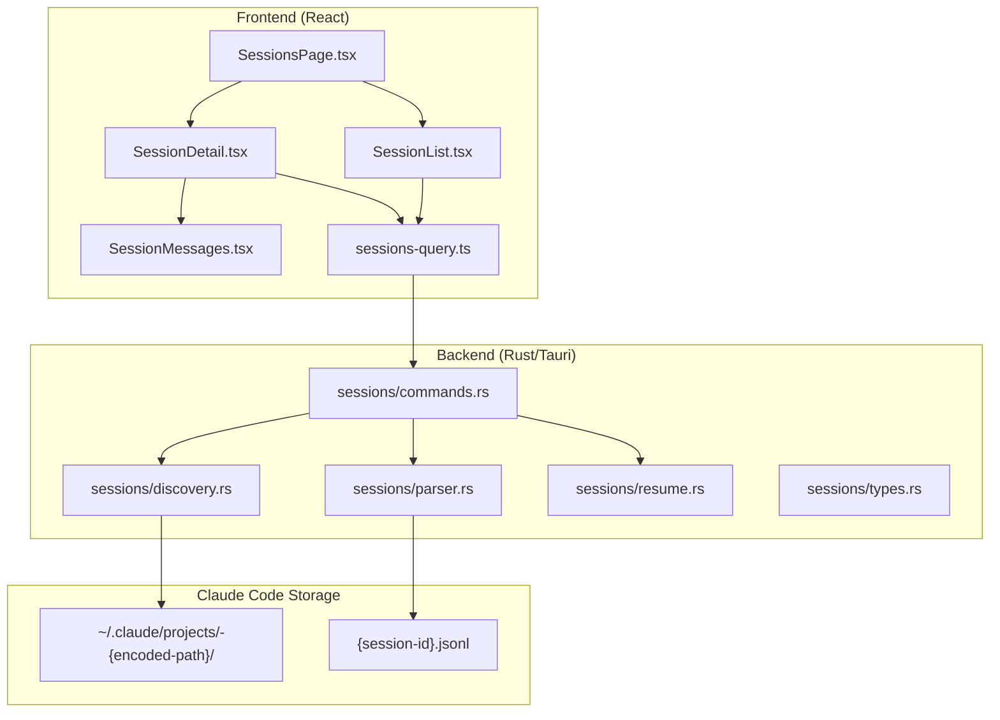

# Claude Code Sessions Integration Plan

**Date:** 2025-12-06
**Status:** Draft
**Author:** Claude Opus 4.5

## Overview

This plan details the complete rewrite of the custom Tasks system to integrate with Claude Code's native session management. Instead of maintaining our own task storage and execution layer, we will directly read Claude Code's session files from `~/.claude/projects/` and use `claude --resume` to continue existing sessions.

### Goals

1. Remove ALL custom Tasks system code
2. Build new Sessions module that reads Claude Code's native JSONL session files
3. Support resuming existing Claude Code sessions via `claude --resume {id}`
4. Display Claude Code sessions as browsable history in the UI
5. Maintain streaming capability for active sessions

### Non-Goals

1. Creating new sessions (users should use Claude Code CLI directly)
2. Modifying session files (read-only access)
3. Supporting global sessions (only project-scoped sessions)

---

## Architecture

### High-Level Architecture



### Data Flow

1. **Session Discovery**: Scan `~/.claude/projects/{encoded-path}/` for `.jsonl` files
2. **Session Parsing**: Parse JSONL files to extract messages and metadata
3. **Session Display**: Show sessions in UI with message history
4. **Session Resume**: Execute `claude --resume {id}` via CLI wrapper
5. **Streaming**: Stream responses back to UI via Tauri events

---

## Claude Code Session File Format

### Storage Location

```
~/.claude/projects/
  -Users-huutri-code-ccmate/     # Project path encoded with dashes
    2fb3056d-5ee6-4116-af6d-8f7b3928b633.jsonl    # Regular session
    agent-8a3840b0.jsonl                           # Agent/delegated session
```

### Path Encoding

Project path `/Users/huutri/code/ccmate` becomes `-Users-huutri-code-ccmate`
- Replace `/` with `-`
- Prepend with `-`

### JSONL Message Schema

Each line in `.jsonl` file is a JSON object with the following structure:

```typescript
interface SessionMessage {
  // Message chain
  parentUuid: string | null;    // Previous message ID
  uuid: string;                 // This message ID
  sessionId: string;            // Session ID
  timestamp: string;            // ISO 8601

  // Message type
  type: "user" | "assistant" | "summary" | "file-history-snapshot";

  // Content
  message: {
    role: "user" | "assistant";
    content: string | MessageContent[];  // Text or structured content
  };

  // Context
  cwd: string;                  // Working directory
  version: string;              // Claude Code version
  gitBranch?: string;           // Git branch

  // Assistant-specific
  model?: string;               // e.g., "claude-sonnet-4-5-20250929"
  usage?: {
    input_tokens: number;
    output_tokens: number;
  };

  // Agent-specific
  agentId?: string;             // For delegated agent sessions
  slug?: string;                // Human-readable session name
  isSidechain?: boolean;        // Agent sidechain flag
}

// Content can be text or structured (tool use)
type MessageContent =
  | { type: "text"; text: string }
  | { type: "tool_use"; id: string; name: string; input: object }
  | { type: "tool_result"; tool_use_id: string; content: string };
```

### Message Types to Handle

1. **user**: User prompts (simple text content)
2. **assistant**: Claude responses (text or tool_use content)
3. **file-history-snapshot**: File versioning metadata (skip in UI)
4. **summary**: Session summaries (show as collapsed)

---

## Backend Implementation

### New Module Structure

```
src-tauri/src/sessions/
  mod.rs           # Module exports
  types.rs         # Session and message types
  discovery.rs     # Scan filesystem for sessions
  parser.rs        # Parse JSONL files
  resume.rs        # Execute claude --resume
  commands.rs      # Tauri commands
```

### Types (types.rs)

```rust
use serde::{Deserialize, Serialize};

/// Session metadata (computed from JSONL)
#[derive(Debug, Clone, Serialize, Deserialize)]
#[serde(rename_all = "camelCase")]
pub struct ClaudeSession {
    pub id: String,                    // Filename without .jsonl
    pub project_path: String,          // Decoded project path
    pub first_message_preview: String, // First user message (truncated)
    pub model: Option<String>,         // Model used
    pub message_count: usize,          // Total messages
    pub created_at: u64,               // First message timestamp
    pub updated_at: u64,               // Last message timestamp
    pub is_agent: bool,                // agent-* prefix
    pub slug: Option<String>,          // Human-readable name
}

/// Parsed message from JSONL
#[derive(Debug, Clone, Serialize, Deserialize)]
#[serde(rename_all = "camelCase")]
pub struct SessionMessage {
    pub uuid: String,
    pub parent_uuid: Option<String>,
    pub timestamp: u64,
    pub role: MessageRole,
    pub content: MessageContent,
    pub model: Option<String>,
    pub tool_uses: Vec<ToolUse>,
}

#[derive(Debug, Clone, Serialize, Deserialize, PartialEq)]
#[serde(rename_all = "lowercase")]
pub enum MessageRole {
    User,
    Assistant,
}

#[derive(Debug, Clone, Serialize, Deserialize)]
#[serde(untagged)]
pub enum MessageContent {
    Text(String),
    Blocks(Vec<ContentBlock>),
}

#[derive(Debug, Clone, Serialize, Deserialize)]
#[serde(tag = "type", rename_all = "snake_case")]
pub enum ContentBlock {
    Text { text: String },
    ToolUse { id: String, name: String, input: serde_json::Value },
    ToolResult { tool_use_id: String, content: String },
}

#[derive(Debug, Clone, Serialize, Deserialize)]
#[serde(rename_all = "camelCase")]
pub struct ToolUse {
    pub name: String,
    pub input: serde_json::Value,
    pub output: Option<String>,
}

/// Resume session result
#[derive(Debug, Clone, Serialize, Deserialize)]
#[serde(rename_all = "camelCase")]
pub struct ResumeResult {
    pub success: bool,
    pub session_id: String,
    pub error: Option<String>,
}
```

### Discovery (discovery.rs)

```rust
use std::fs;
use std::path::PathBuf;
use super::types::ClaudeSession;

/// Get Claude projects directory
pub fn get_claude_projects_dir() -> Result<PathBuf, String> {
    let home = dirs::home_dir()
        .ok_or("Failed to get home directory")?;
    Ok(home.join(".claude").join("projects"))
}

/// Encode project path to Claude's format
/// /Users/huutri/code/ccmate -> -Users-huutri-code-ccmate
pub fn encode_project_path(path: &str) -> String {
    path.replace('/', "-")
}

/// Decode Claude's encoded path back to original
/// -Users-huutri-code-ccmate -> /Users/huutri/code/ccmate
pub fn decode_project_path(encoded: &str) -> String {
    if encoded.starts_with('-') {
        encoded[1..].replace('-', "/")
    } else {
        encoded.replace('-', "/")
    }
}

/// Get project sessions directory
pub fn get_project_sessions_dir(project_path: &str) -> Result<PathBuf, String> {
    let projects_dir = get_claude_projects_dir()?;
    let encoded_path = encode_project_path(project_path);
    let project_dir = projects_dir.join(&encoded_path);

    if !project_dir.exists() {
        return Err(format!("No Claude sessions found for project: {}", project_path));
    }

    Ok(project_dir)
}

/// List all session files for a project
pub fn list_session_files(project_path: &str) -> Result<Vec<PathBuf>, String> {
    let project_dir = get_project_sessions_dir(project_path)?;

    let mut sessions = Vec::new();

    for entry in fs::read_dir(&project_dir)
        .map_err(|e| format!("Failed to read project directory: {}", e))?
    {
        let entry = entry.map_err(|e| format!("Failed to read entry: {}", e))?;
        let path = entry.path();

        if path.extension().and_then(|s| s.to_str()) == Some("jsonl") {
            sessions.push(path);
        }
    }

    // Sort by modification time (most recent first)
    sessions.sort_by(|a, b| {
        let a_time = fs::metadata(a).and_then(|m| m.modified()).ok();
        let b_time = fs::metadata(b).and_then(|m| m.modified()).ok();
        b_time.cmp(&a_time)
    });

    Ok(sessions)
}

/// List all known project directories
pub fn list_known_projects() -> Result<Vec<String>, String> {
    let projects_dir = get_claude_projects_dir()?;

    if !projects_dir.exists() {
        return Ok(Vec::new());
    }

    let mut projects = Vec::new();

    for entry in fs::read_dir(&projects_dir)
        .map_err(|e| format!("Failed to read projects directory: {}", e))?
    {
        let entry = entry.map_err(|e| format!("Failed to read entry: {}", e))?;
        let path = entry.path();

        if path.is_dir() {
            if let Some(name) = path.file_name().and_then(|s| s.to_str()) {
                if name.starts_with('-') {
                    let decoded = decode_project_path(name);
                    // Verify the path exists
                    if PathBuf::from(&decoded).exists() {
                        projects.push(decoded);
                    }
                }
            }
        }
    }

    Ok(projects)
}
```

### Parser (parser.rs)

```rust
use std::fs::File;
use std::io::{BufRead, BufReader};
use std::path::Path;
use super::types::{ClaudeSession, SessionMessage, MessageRole, MessageContent, ContentBlock, ToolUse};

/// Raw JSONL line structure (for deserialization)
#[derive(Debug, serde::Deserialize)]
#[serde(rename_all = "camelCase")]
struct RawLine {
    parent_uuid: Option<String>,
    uuid: String,
    session_id: String,
    timestamp: String,
    #[serde(rename = "type")]
    message_type: String,
    message: Option<RawMessage>,
    cwd: Option<String>,
    model: Option<String>,
    agent_id: Option<String>,
    slug: Option<String>,
    tool_use_result: Option<String>,
}

#[derive(Debug, serde::Deserialize)]
struct RawMessage {
    role: String,
    content: serde_json::Value,
}

/// Parse session file to get metadata
pub fn parse_session_metadata(path: &Path) -> Result<ClaudeSession, String> {
    let file = File::open(path)
        .map_err(|e| format!("Failed to open session file: {}", e))?;
    let reader = BufReader::new(file);

    let filename = path.file_stem()
        .and_then(|s| s.to_str())
        .ok_or("Invalid filename")?;

    let is_agent = filename.starts_with("agent-");
    let session_id = filename.to_string();

    let mut first_user_message: Option<String> = None;
    let mut model: Option<String> = None;
    let mut slug: Option<String> = None;
    let mut message_count = 0;
    let mut first_timestamp: Option<u64> = None;
    let mut last_timestamp: Option<u64> = None;
    let mut project_path = String::new();

    for line in reader.lines() {
        let line = line.map_err(|e| format!("Failed to read line: {}", e))?;
        if line.trim().is_empty() {
            continue;
        }

        let raw: RawLine = match serde_json::from_str(&line) {
            Ok(r) => r,
            Err(_) => continue, // Skip invalid lines
        };

        // Extract working directory for project path
        if project_path.is_empty() {
            if let Some(cwd) = &raw.cwd {
                project_path = cwd.clone();
            }
        }

        // Skip non-message types
        if raw.message_type != "user" && raw.message_type != "assistant" {
            continue;
        }

        message_count += 1;

        // Parse timestamp
        if let Ok(ts) = chrono::DateTime::parse_from_rfc3339(&raw.timestamp) {
            let unix_ts = ts.timestamp() as u64;
            if first_timestamp.is_none() {
                first_timestamp = Some(unix_ts);
            }
            last_timestamp = Some(unix_ts);
        }

        // Extract first user message
        if raw.message_type == "user" && first_user_message.is_none() {
            if let Some(msg) = &raw.message {
                first_user_message = Some(extract_text_content(&msg.content));
            }
        }

        // Extract model from assistant message
        if raw.message_type == "assistant" && model.is_none() {
            model = raw.model.clone();
        }

        // Extract slug
        if slug.is_none() {
            slug = raw.slug.clone();
        }
    }

    Ok(ClaudeSession {
        id: session_id,
        project_path,
        first_message_preview: first_user_message
            .map(|s| truncate_string(&s, 100))
            .unwrap_or_else(|| "No message".to_string()),
        model,
        message_count,
        created_at: first_timestamp.unwrap_or(0),
        updated_at: last_timestamp.unwrap_or(0),
        is_agent,
        slug,
    })
}

/// Parse all messages from session file
pub fn parse_session_messages(path: &Path) -> Result<Vec<SessionMessage>, String> {
    let file = File::open(path)
        .map_err(|e| format!("Failed to open session file: {}", e))?;
    let reader = BufReader::new(file);

    let mut messages = Vec::new();

    for line in reader.lines() {
        let line = line.map_err(|e| format!("Failed to read line: {}", e))?;
        if line.trim().is_empty() {
            continue;
        }

        let raw: RawLine = match serde_json::from_str(&line) {
            Ok(r) => r,
            Err(_) => continue,
        };

        // Only process user and assistant messages
        if raw.message_type != "user" && raw.message_type != "assistant" {
            continue;
        }

        let Some(msg) = &raw.message else {
            continue;
        };

        let role = match msg.role.as_str() {
            "user" => MessageRole::User,
            "assistant" => MessageRole::Assistant,
            _ => continue,
        };

        let (content, tool_uses) = parse_content(&msg.content);

        let timestamp = chrono::DateTime::parse_from_rfc3339(&raw.timestamp)
            .map(|ts| ts.timestamp() as u64)
            .unwrap_or(0);

        messages.push(SessionMessage {
            uuid: raw.uuid,
            parent_uuid: raw.parent_uuid,
            timestamp,
            role,
            content,
            model: raw.model,
            tool_uses,
        });
    }

    // Sort by timestamp
    messages.sort_by_key(|m| m.timestamp);

    Ok(messages)
}

/// Extract text content from message content value
fn extract_text_content(content: &serde_json::Value) -> String {
    match content {
        serde_json::Value::String(s) => s.clone(),
        serde_json::Value::Array(arr) => {
            arr.iter()
                .filter_map(|block| {
                    if block.get("type")?.as_str()? == "text" {
                        block.get("text")?.as_str().map(|s| s.to_string())
                    } else {
                        None
                    }
                })
                .collect::<Vec<_>>()
                .join(" ")
        }
        _ => String::new(),
    }
}

/// Parse content and extract tool uses
fn parse_content(content: &serde_json::Value) -> (MessageContent, Vec<ToolUse>) {
    match content {
        serde_json::Value::String(s) => (MessageContent::Text(s.clone()), Vec::new()),
        serde_json::Value::Array(arr) => {
            let mut tool_uses = Vec::new();
            let mut blocks = Vec::new();

            for item in arr {
                if let Some(type_str) = item.get("type").and_then(|t| t.as_str()) {
                    match type_str {
                        "text" => {
                            if let Some(text) = item.get("text").and_then(|t| t.as_str()) {
                                blocks.push(ContentBlock::Text { text: text.to_string() });
                            }
                        }
                        "tool_use" => {
                            if let (Some(id), Some(name), Some(input)) = (
                                item.get("id").and_then(|i| i.as_str()),
                                item.get("name").and_then(|n| n.as_str()),
                                item.get("input"),
                            ) {
                                blocks.push(ContentBlock::ToolUse {
                                    id: id.to_string(),
                                    name: name.to_string(),
                                    input: input.clone(),
                                });
                                tool_uses.push(ToolUse {
                                    name: name.to_string(),
                                    input: input.clone(),
                                    output: None,
                                });
                            }
                        }
                        "tool_result" => {
                            if let (Some(tool_use_id), Some(content_val)) = (
                                item.get("tool_use_id").and_then(|i| i.as_str()),
                                item.get("content"),
                            ) {
                                let content_str = match content_val {
                                    serde_json::Value::String(s) => s.clone(),
                                    _ => content_val.to_string(),
                                };
                                blocks.push(ContentBlock::ToolResult {
                                    tool_use_id: tool_use_id.to_string(),
                                    content: content_str,
                                });
                            }
                        }
                        _ => {}
                    }
                }
            }

            (MessageContent::Blocks(blocks), tool_uses)
        }
        _ => (MessageContent::Text(String::new()), Vec::new()),
    }
}

/// Truncate string to max length
fn truncate_string(s: &str, max_len: usize) -> String {
    if s.len() <= max_len {
        s.to_string()
    } else {
        format!("{}...", &s[..max_len.saturating_sub(3)])
    }
}
```

### Resume (resume.rs)

```rust
use std::process::Stdio;
use tauri::{AppHandle, Emitter};
use tokio::io::{AsyncBufReadExt, BufReader};
use tokio::process::Command;
use tokio::sync::Mutex;
use std::sync::Arc;
use std::collections::HashMap;

/// Active resume processes
pub type ResumeProcesses = Arc<Mutex<HashMap<String, tokio::process::Child>>>;

/// Initialize resume processes state
pub fn init_resume_processes() -> ResumeProcesses {
    Arc::new(Mutex::new(HashMap::new()))
}

/// Stream event for resume operations
#[derive(Debug, Clone, serde::Serialize)]
#[serde(tag = "type", rename_all = "camelCase")]
pub enum ResumeStreamEvent {
    MessageStart { message_id: String },
    ContentDelta { message_id: String, delta: String },
    MessageComplete { message_id: String, content: String },
    ToolUse { message_id: String, tool_name: String, input: serde_json::Value },
    Error { error: String },
    SessionEnded,
}

/// Resume a session with optional message
pub async fn resume_session(
    app: AppHandle,
    session_id: String,
    message: Option<String>,
    project_path: String,
    processes: ResumeProcesses,
) -> Result<(), String> {
    // Validate project path
    let path = std::path::PathBuf::from(&project_path);
    if !path.is_absolute() || !path.exists() {
        return Err(format!("Invalid project path: {}", project_path));
    }

    // Build command
    let mut cmd = Command::new("claude");
    cmd.arg("--resume")
        .arg(&session_id)
        .arg("--output-format")
        .arg("stream-json")
        .current_dir(&project_path)
        .stdout(Stdio::piped())
        .stderr(Stdio::piped());

    // Add message if provided
    if let Some(msg) = &message {
        cmd.arg("-p").arg(msg);
    }

    // Spawn process
    let mut child = cmd
        .spawn()
        .map_err(|e| format!("Failed to spawn Claude CLI: {}", e))?;

    // Take stdout
    let stdout = child.stdout.take()
        .ok_or("Failed to get stdout")?;

    // Store process
    {
        let mut procs = processes.lock().await;
        procs.insert(session_id.clone(), child);
    }

    // Read and emit events
    let event_name = format!("session-stream:{}", session_id);
    let reader = BufReader::new(stdout);
    let mut lines = reader.lines();

    let mut current_message_id = String::new();
    let mut accumulated_content = String::new();

    while let Ok(Some(line)) = lines.next_line().await {
        if line.trim().is_empty() {
            continue;
        }

        // Parse JSON line
        let json_value: serde_json::Value = match serde_json::from_str(&line) {
            Ok(v) => v,
            Err(_) => continue,
        };

        // Parse event and emit
        if let Some(event) = parse_stream_event(&json_value, &mut current_message_id, &mut accumulated_content) {
            let _ = app.emit(&event_name, event);
        }
    }

    // Emit session ended
    let _ = app.emit(&event_name, ResumeStreamEvent::SessionEnded);

    // Cleanup
    {
        let mut procs = processes.lock().await;
        if let Some(mut child) = procs.remove(&session_id) {
            let _ = child.wait().await;
        }
    }

    Ok(())
}

/// Cancel resume session
pub async fn cancel_resume(session_id: &str, processes: ResumeProcesses) -> Result<(), String> {
    let mut procs = processes.lock().await;
    if let Some(mut child) = procs.remove(session_id) {
        child.kill().await.map_err(|e| format!("Failed to kill process: {}", e))?;
    }
    Ok(())
}

/// Parse Claude CLI stream event
fn parse_stream_event(
    json: &serde_json::Value,
    current_message_id: &mut String,
    accumulated_content: &mut String,
) -> Option<ResumeStreamEvent> {
    let top_type = json.get("type")?.as_str()?;

    if top_type == "stream_event" {
        let event = json.get("event")?;
        let event_type = event.get("type")?.as_str()?;

        match event_type {
            "message_start" => {
                let msg_id = event.get("message")?.get("id")?.as_str()?.to_string();
                *current_message_id = msg_id.clone();
                *accumulated_content = String::new();
                Some(ResumeStreamEvent::MessageStart { message_id: msg_id })
            }
            "content_block_delta" => {
                let delta = event.get("delta")?.get("text")?.as_str()?.to_string();
                *accumulated_content += &delta;
                Some(ResumeStreamEvent::ContentDelta {
                    message_id: current_message_id.clone(),
                    delta,
                })
            }
            "message_stop" => {
                Some(ResumeStreamEvent::MessageComplete {
                    message_id: current_message_id.clone(),
                    content: accumulated_content.clone(),
                })
            }
            _ => None,
        }
    } else {
        None
    }
}
```

### Commands (commands.rs)

```rust
use super::discovery;
use super::parser;
use super::resume::{self, ResumeProcesses};
use super::types::{ClaudeSession, SessionMessage};
use tauri::{AppHandle, State};

/// Check if Claude CLI is installed
#[tauri::command]
pub async fn session_check_claude_installed() -> Result<bool, String> {
    let output = tokio::process::Command::new("which")
        .arg("claude")
        .output()
        .await
        .map_err(|e| format!("Failed to check Claude installation: {}", e))?;

    Ok(output.status.success())
}

/// List all sessions for a project
#[tauri::command]
pub async fn session_list(project_path: String) -> Result<Vec<ClaudeSession>, String> {
    let session_files = discovery::list_session_files(&project_path)?;

    let mut sessions = Vec::new();
    for file_path in session_files {
        match parser::parse_session_metadata(&file_path) {
            Ok(session) => sessions.push(session),
            Err(e) => {
                eprintln!("Failed to parse session {:?}: {}", file_path, e);
                continue;
            }
        }
    }

    // Sort by updated_at descending
    sessions.sort_by(|a, b| b.updated_at.cmp(&a.updated_at));

    Ok(sessions)
}

/// Get session messages
#[tauri::command]
pub async fn session_get_messages(
    project_path: String,
    session_id: String,
) -> Result<Vec<SessionMessage>, String> {
    // Validate session_id to prevent path traversal
    if session_id.contains("..") || session_id.contains('/') || session_id.contains('\\') {
        return Err("Invalid session ID".to_string());
    }

    let project_dir = discovery::get_project_sessions_dir(&project_path)?;
    let session_file = project_dir.join(format!("{}.jsonl", session_id));

    if !session_file.exists() {
        return Err(format!("Session not found: {}", session_id));
    }

    parser::parse_session_messages(&session_file)
}

/// Resume a session
#[tauri::command]
pub async fn session_resume(
    app: AppHandle,
    project_path: String,
    session_id: String,
    message: Option<String>,
    processes: State<'_, ResumeProcesses>,
) -> Result<(), String> {
    resume::resume_session(
        app,
        session_id,
        message,
        project_path,
        processes.inner().clone(),
    )
    .await
}

/// Cancel resume session
#[tauri::command]
pub async fn session_cancel(
    session_id: String,
    processes: State<'_, ResumeProcesses>,
) -> Result<(), String> {
    resume::cancel_resume(&session_id, processes.inner().clone()).await
}

/// List all projects with Claude sessions
#[tauri::command]
pub async fn session_list_projects() -> Result<Vec<String>, String> {
    discovery::list_known_projects()
}

/// Get session count for a project
#[tauri::command]
pub async fn session_count(project_path: String) -> Result<usize, String> {
    let sessions = discovery::list_session_files(&project_path)?;
    Ok(sessions.len())
}
```

### Module Export (mod.rs)

```rust
pub mod commands;
pub mod discovery;
pub mod parser;
pub mod resume;
pub mod types;

pub use commands::*;
pub use resume::init_resume_processes;
pub use resume::ResumeProcesses;
```

---

## Frontend Implementation

### New Files

```
src/lib/sessions-query.ts     # React Query hooks
src/pages/SessionsPage.tsx    # Main sessions page
src/components/sessions/
  index.ts                    # Exports
  SessionList.tsx             # Session list sidebar
  SessionCard.tsx             # Session card component
  SessionDetail.tsx           # Session detail view
  SessionMessages.tsx         # Message list
  MessageBubble.tsx           # Individual message
```

### Sessions Query (sessions-query.ts)

```typescript
import { useMutation, useQuery, useQueryClient } from "@tanstack/react-query";
import { invoke } from "@tauri-apps/api/core";
import { listen } from "@tauri-apps/api/event";

// Types
export interface ClaudeSession {
  id: string;
  projectPath: string;
  firstMessagePreview: string;
  model?: string;
  messageCount: number;
  createdAt: number;
  updatedAt: number;
  isAgent: boolean;
  slug?: string;
}

export interface SessionMessage {
  uuid: string;
  parentUuid?: string;
  timestamp: number;
  role: "user" | "assistant";
  content: MessageContent;
  model?: string;
  toolUses: ToolUse[];
}

export type MessageContent =
  | string
  | ContentBlock[];

export type ContentBlock =
  | { type: "text"; text: string }
  | { type: "tool_use"; id: string; name: string; input: unknown }
  | { type: "tool_result"; toolUseId: string; content: string };

export interface ToolUse {
  name: string;
  input: unknown;
  output?: string;
}

export type ResumeStreamEvent =
  | { type: "messageStart"; messageId: string }
  | { type: "contentDelta"; messageId: string; delta: string }
  | { type: "messageComplete"; messageId: string; content: string }
  | { type: "toolUse"; messageId: string; toolName: string; input: unknown }
  | { type: "error"; error: string }
  | { type: "sessionEnded" };

// Query Keys
export const sessionKeys = {
  all: ["sessions"] as const,
  project: (projectPath: string) => [...sessionKeys.all, projectPath] as const,
  messages: (projectPath: string, sessionId: string) =>
    [...sessionKeys.project(projectPath), "messages", sessionId] as const,
  count: (projectPath: string) =>
    [...sessionKeys.project(projectPath), "count"] as const,
  projects: ["session-projects"] as const,
};

// Hooks

/** Check if Claude CLI is installed */
export function useCheckClaudeInstalled() {
  return useQuery({
    queryKey: ["claude-installed"],
    queryFn: async () => invoke<boolean>("session_check_claude_installed"),
    staleTime: 5 * 60 * 1000,
  });
}

/** List all sessions for a project */
export function useSessions(projectPath: string) {
  return useQuery({
    queryKey: sessionKeys.project(projectPath),
    queryFn: async () => invoke<ClaudeSession[]>("session_list", { projectPath }),
    enabled: !!projectPath,
    refetchInterval: 30000, // Refresh every 30s to catch new sessions
  });
}

/** Get session messages */
export function useSessionMessages(projectPath: string, sessionId: string) {
  return useQuery({
    queryKey: sessionKeys.messages(projectPath, sessionId),
    queryFn: async () =>
      invoke<SessionMessage[]>("session_get_messages", { projectPath, sessionId }),
    enabled: !!projectPath && !!sessionId,
  });
}

/** Resume session */
export function useResumeSession() {
  const queryClient = useQueryClient();

  return useMutation({
    mutationFn: async ({
      projectPath,
      sessionId,
      message,
    }: {
      projectPath: string;
      sessionId: string;
      message?: string;
    }) => {
      await invoke("session_resume", { projectPath, sessionId, message });
    },
    onSuccess: (_, variables) => {
      // Invalidate to refetch new messages
      queryClient.invalidateQueries({
        queryKey: sessionKeys.messages(variables.projectPath, variables.sessionId),
      });
    },
  });
}

/** Cancel resume session */
export function useCancelSession() {
  return useMutation({
    mutationFn: async (sessionId: string) => {
      await invoke("session_cancel", { sessionId });
    },
  });
}

/** List projects with sessions */
export function useSessionProjects() {
  return useQuery({
    queryKey: sessionKeys.projects,
    queryFn: async () => invoke<string[]>("session_list_projects"),
  });
}

/** Session count for a project */
export function useSessionCount(projectPath: string) {
  return useQuery({
    queryKey: sessionKeys.count(projectPath),
    queryFn: async () => invoke<number>("session_count", { projectPath }),
    enabled: !!projectPath,
  });
}

/** Listen to session stream events */
export function useSessionStream(
  sessionId: string,
  onEvent: (event: ResumeStreamEvent) => void
) {
  return useQuery({
    queryKey: ["session-stream", sessionId],
    queryFn: async () => {
      const unlisten = await listen<ResumeStreamEvent>(
        `session-stream:${sessionId}`,
        (event) => {
          onEvent(event.payload);
        }
      );
      return unlisten;
    },
    enabled: !!sessionId,
    staleTime: Infinity,
    gcTime: 0,
  });
}
```

### Sessions Page (SessionsPage.tsx)

```typescript
import { useState } from "react";
import { SessionList } from "@/components/sessions/SessionList";
import { SessionDetail } from "@/components/sessions/SessionDetail";
import {
  ResizableHandle,
  ResizablePanel,
  ResizablePanelGroup,
} from "@/components/ui/resizable";

export function SessionsPage() {
  const [selectedSessionId, setSelectedSessionId] = useState<string | undefined>();

  return (
    <div className="h-full w-full">
      <ResizablePanelGroup direction="horizontal">
        <ResizablePanel defaultSize={35} minSize={25} maxSize={50}>
          <SessionList
            selectedSessionId={selectedSessionId}
            onSelectSession={setSelectedSessionId}
          />
        </ResizablePanel>

        <ResizableHandle withHandle />

        <ResizablePanel defaultSize={65} minSize={50}>
          {selectedSessionId ? (
            <SessionDetail sessionId={selectedSessionId} />
          ) : (
            <div className="flex items-center justify-center h-full text-muted-foreground">
              Select a session to view messages
            </div>
          )}
        </ResizablePanel>
      </ResizablePanelGroup>
    </div>
  );
}
```

---

## Files to Delete

### Backend (src-tauri/src/)

```
tasks/                          # Entire tasks module
  mod.rs
  task.rs
  manager.rs
  storage.rs
  commands.rs

chat/                           # Custom chat module (will be replaced)
  mod.rs
  session.rs
  storage.rs
  claude_cli.rs                 # Keep/refactor for resume functionality
  commands.rs
  tests.rs
```

### Frontend (src/)

```
lib/tasks-query.ts              # Tasks React Query hooks
pages/TasksPage.tsx             # Tasks page
components/tasks/               # Entire tasks components folder
  index.ts
  TaskCard.tsx
  TaskDetail.tsx
  TaskInput.tsx
  TaskList.tsx
  TaskMessages.tsx
  TaskStatusBadge.tsx
```

### Storage

```
~/.ccconfig/tasks/              # Custom task storage (can be left, not used)
~/.ccconfig/chat-sessions/      # Custom chat storage (can be left, not used)
```

---

## Files to Modify

### Backend

1. **src-tauri/src/lib.rs**
   - Remove `mod tasks;` import
   - Remove `mod chat;` import (if exists)
   - Add `mod sessions;` import
   - Remove all `tasks::*` command registrations
   - Add `sessions::*` command registrations
   - Update state management for `ResumeProcesses`

2. **src-tauri/Cargo.toml**
   - Add `chrono` dependency for timestamp parsing

### Frontend

1. **src/router.tsx**
   - Replace TasksPage route with SessionsPage
   - Update path from `tasks` to `sessions`

2. **src/components/ContextLayout.tsx**
   - Update navigation link from "Tasks" to "Sessions"

---

## Implementation Phases

### Phase 1: Backend Foundation (Day 1)

**Objective:** Create core sessions module with discovery and parsing

**Tasks:**
- [ ] Create `src-tauri/src/sessions/` directory
- [ ] Implement `types.rs` with all type definitions
- [ ] Implement `discovery.rs` for session file scanning
- [ ] Implement `parser.rs` for JSONL parsing
- [ ] Add `chrono` to Cargo.toml
- [ ] Create `mod.rs` with exports
- [ ] Unit tests for parser

**Deliverables:**
- Session files can be discovered
- JSONL files can be parsed into structured data
- Metadata extraction works correctly

### Phase 2: Backend Commands (Day 1-2)

**Objective:** Expose session data through Tauri commands

**Tasks:**
- [ ] Implement `commands.rs` with all Tauri commands
- [ ] Implement `resume.rs` for session resumption
- [ ] Register commands in `lib.rs`
- [ ] Remove old tasks commands from `lib.rs`
- [ ] Add state management for ResumeProcesses
- [ ] Integration tests

**Deliverables:**
- All session commands callable from frontend
- Resume functionality works with streaming
- Old tasks code removed from registration

### Phase 3: Frontend Data Layer (Day 2)

**Objective:** Create React Query hooks for sessions

**Tasks:**
- [ ] Create `src/lib/sessions-query.ts`
- [ ] Implement all session hooks
- [ ] Implement stream event listener hook
- [ ] Remove `tasks-query.ts`
- [ ] Update any imports

**Deliverables:**
- Sessions data fetchable from frontend
- Stream events can be received
- Old tasks queries removed

### Phase 4: Frontend UI (Day 2-3)

**Objective:** Build session browsing UI

**Tasks:**
- [ ] Create `src/components/sessions/` directory
- [ ] Implement `SessionList.tsx` with search/filter
- [ ] Implement `SessionCard.tsx`
- [ ] Implement `SessionDetail.tsx`
- [ ] Implement `SessionMessages.tsx`
- [ ] Implement `MessageBubble.tsx`
- [ ] Create `index.ts` exports

**Deliverables:**
- Sessions displayed in list
- Session messages viewable
- Messages rendered with markdown

### Phase 5: Sessions Page Integration (Day 3)

**Objective:** Create main sessions page and integrate with app

**Tasks:**
- [ ] Create `SessionsPage.tsx`
- [ ] Update `router.tsx` routes
- [ ] Update `ContextLayout.tsx` navigation
- [ ] Remove TasksPage import
- [ ] Delete old tasks components
- [ ] Test full flow

**Deliverables:**
- Sessions page accessible from navigation
- Full session browsing works
- Old tasks UI removed

### Phase 6: Resume Functionality (Day 3-4)

**Objective:** Implement session resume with streaming

**Tasks:**
- [ ] Add resume button to SessionDetail
- [ ] Implement resume input UI
- [ ] Handle stream events in UI
- [ ] Display streaming content
- [ ] Handle session end gracefully
- [ ] Error handling for CLI failures

**Deliverables:**
- Users can resume existing sessions
- Streaming responses display in real-time
- Errors displayed appropriately

### Phase 7: Cleanup & Polish (Day 4)

**Objective:** Remove old code and polish

**Tasks:**
- [ ] Delete `src-tauri/src/tasks/` directory
- [ ] Delete `src-tauri/src/chat/` directory
- [ ] Delete `src/components/tasks/` directory
- [ ] Delete `src/lib/tasks-query.ts`
- [ ] Delete `src/pages/TasksPage.tsx`
- [ ] Update any remaining references
- [ ] Final testing
- [ ] Documentation update

**Deliverables:**
- No dead code remaining
- All tests pass
- Documentation updated

---

## Testing Strategy

### Unit Tests

1. **Parser Tests**
   - Valid JSONL parsing
   - Invalid JSON handling
   - Empty file handling
   - Large file performance
   - Message type filtering

2. **Discovery Tests**
   - Path encoding/decoding
   - Session file listing
   - Non-existent path handling

### Integration Tests

1. **Session Listing**
   - Multiple sessions per project
   - Different session types (regular, agent)
   - Metadata accuracy

2. **Message Parsing**
   - User messages
   - Assistant messages
   - Tool use content
   - Message ordering

3. **Resume Flow**
   - Session resume command
   - Stream event emission
   - Cancellation handling

### E2E Tests

1. **UI Flow**
   - Navigate to sessions page
   - Select session from list
   - View message history
   - Resume session
   - Receive streaming response

---

## Edge Cases

### File System

1. **Corrupted JSONL**
   - Skip invalid lines, continue parsing
   - Log warnings for debugging

2. **Empty Session Files**
   - Return empty message list
   - Show "No messages" in UI

3. **Permission Errors**
   - Graceful error message
   - Suggest checking permissions

### Claude CLI

1. **CLI Not Installed**
   - Show installation prompt
   - Disable resume functionality

2. **Session Not Found**
   - Show clear error message
   - Offer to refresh session list

3. **Resume Timeout**
   - Implement timeout handling
   - Allow manual cancellation

### Concurrent Operations

1. **Multiple Resume Attempts**
   - Prevent duplicate resume for same session
   - Queue or reject additional attempts

2. **Session List Updates**
   - Auto-refresh on focus
   - Manual refresh button

---

## Migration Checklist

- [ ] Backup existing code (git branch)
- [ ] Implement Phase 1-7 in order
- [ ] Test each phase before proceeding
- [ ] Verify no references to deleted files
- [ ] Update CLAUDE.md if needed
- [ ] Update any documentation
- [ ] Test on fresh install

---

## Estimated Effort

| Phase | Description | Estimated Hours |
|-------|-------------|-----------------|
| 1 | Backend Foundation | 3-4 hours |
| 2 | Backend Commands | 2-3 hours |
| 3 | Frontend Data Layer | 2-3 hours |
| 4 | Frontend UI | 4-6 hours |
| 5 | Sessions Page Integration | 2-3 hours |
| 6 | Resume Functionality | 3-4 hours |
| 7 | Cleanup & Polish | 2-3 hours |
| **Total** | | **18-26 hours** |

---

## Risks and Mitigations

| Risk | Impact | Mitigation |
|------|--------|------------|
| JSONL format changes in Claude Code | High | Version check, flexible parsing |
| Large session files performance | Medium | Lazy loading, pagination |
| CLI behavior differences across versions | Medium | Document supported versions |
| Stream parsing edge cases | Medium | Comprehensive error handling |

---

## Unresolved Questions

1. **Session deletion** - Should we support deleting Claude Code sessions from the UI, or keep read-only?
   - Recommendation: Read-only initially, defer to Claude CLI for management

2. **Global sessions** - Should we show sessions not tied to a specific project?
   - Recommendation: Project-scoped only for now, matches existing context model

3. **Session creation** - Should users be able to start new sessions from UI?
   - Recommendation: Not in initial release, users should use Claude CLI directly

4. **Offline handling** - What if Claude CLI is not available during resume?
   - Recommendation: Clear error message, disable resume button

---

## Appendix: Claude Code JSONL Message Examples

### User Message
```json
{
  "parentUuid": null,
  "uuid": "020829b6-a993-41dc-8032-df7c37dc722f",
  "sessionId": "15460503-a27b-4409-bc47-7ee22d64795b",
  "timestamp": "2025-12-06T09:34:11.283Z",
  "type": "user",
  "message": {
    "role": "user",
    "content": "Hello, explain this code"
  },
  "cwd": "/Users/huutri/code/project",
  "version": "2.0.60",
  "gitBranch": "main"
}
```

### Assistant Message (Text)
```json
{
  "parentUuid": "020829b6-a993-41dc-8032-df7c37dc722f",
  "uuid": "ed1ff938-216f-410c-9bb2-bc15adf4d010",
  "sessionId": "15460503-a27b-4409-bc47-7ee22d64795b",
  "timestamp": "2025-12-06T09:34:14.613Z",
  "type": "assistant",
  "message": {
    "role": "assistant",
    "content": [{"type": "text", "text": "This code does..."}]
  },
  "model": "claude-sonnet-4-5-20250929",
  "usage": {"input_tokens": 653, "output_tokens": 17}
}
```

### Assistant Message (Tool Use)
```json
{
  "type": "assistant",
  "message": {
    "role": "assistant",
    "content": [
      {"type": "tool_use", "id": "toolu_01...", "name": "Read", "input": {"file_path": "/path/to/file"}}
    ]
  }
}
```

### Tool Result
```json
{
  "type": "user",
  "message": {
    "role": "user",
    "content": [
      {"type": "tool_result", "tool_use_id": "toolu_01...", "content": "file contents..."}
    ]
  }
}
```
